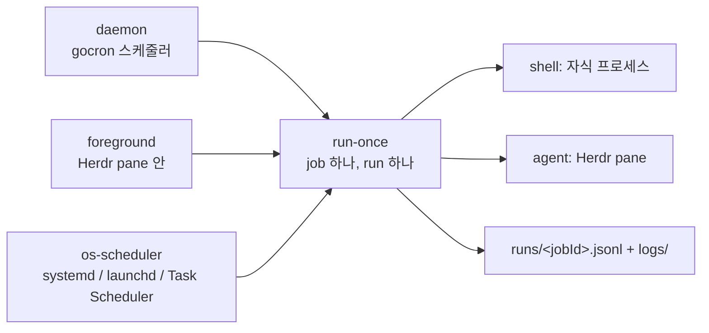

# herdr-cron

*[English](README.md) · 한국어*

자동화된 작업을 위한 스케줄러입니다. `herdr-cron`은 셸 명령과 코딩 에이전트 프롬프트를 정해진 일정에 따라 [Herdr](https://herdr.dev) pane 안에서 실행합니다. Go 바이너리 하나, 코딩 에이전트가 다루는 JSON 우선 CLI, 사람이 읽는 마우스 기반 TUI로 구성됩니다. Linux·macOS·Windows를 지원하며, 순수 Go(cgo 없음)로 서버도 데이터베이스도 필요하지 않습니다.

## 무엇이고, 왜 필요합니까

에이전트 스케줄링 영역은 비어 있지 않습니다. 코드를 한 줄 쓰기 전에 이미 출시된 다섯 개 시스템을 1차 자료로 읽었습니다([`docs/spec/01-overview.md`](docs/spec/01-overview.md) §1.1). 다만 그중 어느 것도 이 교집합을 채우지 못합니다. 터미널 멀티플렉서의 오래 사는 pane — 세션이 detach 후에도 살아남고, 클라이언트가 붙어 있지 않아도 에이전트를 띄우고 프롬프트를 주고 읽을 수 있는 그 실행 기반 — 위로 작업을 스케줄링하는 시스템은 없습니다. 코딩 에이전트를 1차 호출자로 설계한 시스템도 없습니다. 안정된 error code 어휘, 스케줄 dry run, 스스로를 설명하는 명령 트리, 바이너리에 내장된 skill 대신, 슬래시 명령이나 실행 중인 태스크가 자기 자신에게 호출하는 MCP 도구만 있을 뿐입니다. "왜 03시에 이게 안 돌았는가"를 읽어야 하는 사람을 위한 터미널 UI를 함께 제공하는 시스템도 없습니다 — 대안들은 웹 서버를 띄우거나 아무것도 주지 않습니다. 크로스 플랫폼은 드물게 주장되고 더 드물게 지켜집니다. 그리고 실제로 일어나는 무인 실패 모드 — 신뢰된 적 없는 디렉터리에서 시작된 에이전트가 승인 다이얼로그 앞에서 영원히 멈춰 있고, 건물 안에 사람은 없는 상황 — 를 모델링한 시스템도 없습니다.

herdr-cron은 정확히 그 교집합입니다. Herdr 네이티브 실행, 에이전트 우선 제어, 사람 우선 조회, 바이너리 하나, 서버 없음. 워크플로 엔진이 아닙니다. DAG도, step도, 의존 관계도 없습니다. 하나의 job은 하나의 명령이거나 하나의 프롬프트입니다. 스케줄러가 의존 관계를 갖는 순간 두 번째 시스템을 운영하게 되기 때문입니다.

## 설치

### Herdr 플러그인으로

```sh
herdr plugin install huketo/herdr-cron
```

설치 시 소스에서 바이너리를 빌드하고(마켓플레이스는 바이너리를 배포하지 않습니다), 서버가 뜰 때마다 스케줄러를 올리는 `[[startup]]` 훅을 등록하고, 전역 action 네 개와 pane surface로서의 TUI를 추가합니다. 그다음 에이전트가 찾을 수 있는 위치에 바이너리를 놓습니다:

```sh
herdr plugin action invoke huketo.herdr-cron.install-cli
```

개발 중이라면 작업 트리를 그대로 연결합니다. `plugin link`는 의도적으로 build 명령을 건너뛰므로 먼저 빌드해야 합니다:

```sh
make build && herdr plugin link .
```

### Go 툴체인으로

플러그인 매니페스트는 선택입니다. `kind: agent` job을 제외하면 Herdr 없이도 전부 동작합니다.

```sh
go install github.com/huketo/herdr-cron/cmd/herdr-cron@latest
```

### 릴리스 아카이브로

태그마다 여섯 개 타깃(Linux·macOS·Windows × amd64·arm64)의 아카이브가 [GitHub Releases 페이지](https://github.com/huketo/herdr-cron/releases)에 게시됩니다. 플랫폼에 맞는 것을 내려받아 `checksums.txt`로 검증하고, 압축을 푼 `herdr-cron` 바이너리를 `PATH` 위 아무 디렉터리에 두면 됩니다. 아카이브에는 Agent Skill도 함께 들어 있어, 아무것도 실행하지 않고 skill만 설치할 수도 있습니다.

### 에이전트가 쓸 수 있게 만들기

```sh
herdr-cron install-cli --with-skill
```

실행 중인 바이너리를 `PATH` 위 디렉터리(Unix는 `~/.local/bin`, Windows는 `%LocalAppData%\Microsoft\WindowsApps`)에 링크하고, 그 옆에 내장 Agent Skill을 설치합니다. skill 디렉터리를 스캔하는 하네스가 [`skills/herdr-cron/SKILL.md`](skills/herdr-cron/SKILL.md)를 그대로 인식합니다. 다시 실행해도 no-op입니다. 디렉터리를 지정하고 기존 항목을 덮어쓰려면 `herdr-cron install-cli --dir ~/.local/bin --force --with-skill`을 쓰십시오.

## 빠른 시작

일정을 쓰기 전에 먼저 검증하십시오. daemon이 쓰는 것과 동일한 코드로 파싱하므로, 조용히 한 번도 안 뜰 job이 이 지점에서 실패합니다:

```sh
herdr-cron validate --schedule "17 3 * * 1-5" --timezone Asia/Seoul --next 5
```

셸 job을 추가합니다:

```sh
herdr-cron job add --id build-smoke --schedule 30m --command 'go build ./... && go test ./...' --cwd ~/src/herdr --timeout 10m
```

daemon 없이, 이 프로세스에서 동기적으로 한 번 실행합니다:

```sh
herdr-cron run-once build-smoke
```

에이전트 job을 추가합니다. 프롬프트를 주면 `kind: agent`, 명령을 주면 `kind: shell`이 되며, 둘을 함께 주면 usage 오류입니다:

```sh
herdr-cron job add --id nightly-deps --schedule "17 3 * * 1-5" --timezone Asia/Seoul --prompt 'Audit dependencies in this repo. If everything is current, reply with exactly HEARTBEAT_OK and stop.' --cwd ~/src/herdr --timeout 45m --no-op-marker HEARTBEAT_OK --max-runs-per-day 4
```

무슨 일이 있었는지 확인합니다:

```sh
herdr-cron job get nightly-deps
herdr-cron run list --job nightly-deps --limit 10
herdr-cron run logs nightly-deps-20260901T181700Z --tail 200
```

위 명령은 모두 stdout에 JSON을 출력합니다. 사람이 읽는 형태가 필요하면 `-o text`를 붙이십시오. 단, 그 출력은 호환성을 약속하지 않습니다.

## 한 번만 실행할 job 예약

현재 시각을 기준으로 지정하려면 `+` 접두사를 쓰고, 시각이 정해져 있으면 RFC 3339
절대 시각을 지정합니다:

```sh
herdr-cron job add --id demo-backup --schedule "+2h" --command "..."
# Or name the absolute instant directly:
herdr-cron job add --id demo-backup --schedule "2026-12-24T18:00:00+09:00" --command "..."
```

두 명령은 같은 Job을 만드는 대안입니다. `+2h`는 한 번만 해석되어 절대 시각으로
저장되지만, `+`가 없는 `2h`는 반복 Job을 만듭니다. 이미 지나간 절대 시각은 usage
오류로 거부됩니다. 일회성 Job에는 Jitter가 적용되지 않으므로, `job get`에 표시된
시각에 그대로 실행됩니다.

해당 시각에 daemon이 꺼져 있었다면 기본 1시간 catch-up 창 안의 Occurrence는
`trigger: "catchup"`으로 실행됩니다. 창보다 오래된 Occurrence는 `missed_window`
사유가 붙은 `skipped` Run으로 기록되고, `catchup: off`이면 `catchup_off` 사유가
붙습니다. 놓친 일회성 예약은 무슨 일이 있었는지 설명하는 Run 없이 사라지지 않습니다.

Occurrence가 실행 대상으로 확정되거나 skipped로 기록되면 `job get`과 `job list` 요약이
`completed: true`를 보고합니다. 이는 하나뿐인 Occurrence가 소진되었다는 뜻이며, Run이
성공했다는 뜻은 아닙니다. 이 필드는 일회성 Job에서만 나타나고 `state.json`에서
파생됩니다. herdr-cron은 완료를 표시하려고 `jobs.yaml`을 고치지 않습니다. 히스토리를
확인한 뒤 정의가 더는 필요하지 않으면 명시적으로 제거합니다:

```sh
herdr-cron job get demo-backup
herdr-cron run list --job demo-backup --status all
herdr-cron job rm demo-backup --yes
```

## job은 어떻게 실행됩니까

작업을 실제로 실행하는 원시 명령은 오직 하나입니다:

```sh
herdr-cron run-once <job-id>
```

호출한 프로세스 안에서 동기적으로, daemon 없이 정확히 한 번의 run을 수행하고, 그 run이 받은 종료 코드로 끝납니다. 그 위에 세 개의 교체 가능한 driver가 있으며, 어떤 driver를 쓰든 job의 의미는 달라지지 않습니다. 기계를 실제로 쓰는 방식에 맞는 것을 고르십시오.

| Driver | 실행 방법 | 얻는 것 | 치르는 비용 |
| --- | --- | --- | --- |
| `daemon` | `herdr-cron daemon --detach`, 또는 플러그인의 startup 훅 | 기본값. 새 job이 즉시 반영되고, catch-up·jitter·트리거·회로 차단기가 모두 여기 산다 | 프로세스가 계속 살아 있어야 한다 |
| `foreground` | `herdr-cron daemon --foreground`, 보통 Herdr pane 안에서 | 로그가 stderr로 보이고, Windows에서 자명하게 올바르다 | pane과 함께 죽는다 |
| `os-scheduler` | job마다 systemd user timer / launchd LaunchAgent / Windows Scheduled Task 하나씩, 각각 `run-once`를 exec | "노트북이 여섯 시간 잤다"를 systemd `Persistent=true`로 OS가 공짜로 답해 준다 | job 수만큼 OS 항목이 생기고, 정확히 번역할 수 없는 두 가지 일정 형태는 근사하지 않고 거부한다 |



driver를 OS에 등록합니다:

```sh
herdr-cron service install --driver os-scheduler --now
herdr-cron service status --driver os-scheduler
herdr-cron service uninstall --driver os-scheduler --yes
```

herdr-cron이 쓰는 모든 산출물에는 마커 펜스가 둘러져 있습니다. 그래서 `herdr-cron service status --driver daemon`이 `ok`, `stale`(손으로 편집됨), `orphan`(job이 `jobs.yaml`에서 사라짐), `missing`을 구분해 보고할 수 있고, uninstall은 자신이 소유한 것만 정확히 쓸어 갑니다. 같은 이름이라도 펜스가 없는 파일은 덮어쓰기를 거부합니다.

스케줄러 자신의 생존 여부, 확정된 root 경로, 다음 발생 시각은 daemon이 없어도 되는 읽기 전용 명령 하나가 알려 줍니다:

```sh
herdr-cron status
```

## job 정의

정의는 사람이 작성하고, 주석이 보존되며, git에 커밋할 수 있는 `jobs.yaml`에 있습니다. 쓰기는 구조체 마샬링 왕복이 아니라 YAML 노드 트리를 거치므로 주석과 키 순서가 `herdr-cron job update` 이후에도 살아남습니다. 유효하지 않은 파일이 될 쓰기는 rename 전에 중단되어 원본이 바이트 단위로 그대로 남습니다.

| OS | `jobs.yaml` | state root |
| --- | --- | --- |
| Linux | `~/.config/herdr-cron/jobs.yaml` | `~/.local/state/herdr-cron` |
| macOS | `~/Library/Application Support/herdr-cron/config/jobs.yaml` | `~/Library/Application Support/herdr-cron/state` |
| Windows | `%LocalAppData%\herdr-cron\config\jobs.yaml` | `%LocalAppData%\herdr-cron\state` |

Windows에서 로밍 `AppData`가 아니라 `LocalAppData`를 쓰는 것은 의도된 선택입니다. 로밍으로 복제된 job 데이터베이스는 다른 기계에서 존재하지 않는 절대 경로를 향해 job을 발사합니다. `XDG_CONFIG_HOME`과 `XDG_STATE_HOME`은 세 플랫폼 모두에서 존중되고, `HERDR_CRON_CONFIG`·`HERDR_CRON_STATE_DIR`·`HERDR_CRON_HOME`이 그것을 덮으며, 플래그가 전부를 덮습니다. `HERDR_PLUGIN_STATE_DIR`은 의도적으로 무시합니다. state root는 기계에만 의존하고 어느 front door가 프로세스를 띄웠는지에는 의존하지 않아야 하며, 그래야 플러그인과 단독 CLI가 언제나 하나의 일정, 하나의 히스토리, 하나의 daemon lock을 공유합니다.

두 종류의 job이 하나씩 든 완전한 파일입니다:

```yaml
version: 1

defaults:
  timezone: local
  timeout: 30m
  concurrency: skip
  jitter: auto
  catchup: latest
  catchup_window: 168h
  limits:
    max_consecutive_failures: 3
  notify:
    on: [failure, blocked, auto_disabled]

jobs:
  - id: nightly-deps
    name: Nightly dependency audit
    description: Check for outdated deps and report.
    enabled: true
    tags: [maintenance, repo:herdr]

    schedule:
      cron: "17 3 * * 1-5"      # :00이 아니라 :17 — 남들이 몰리는 정각을 피한다
      timezone: Asia/Seoul
      catchup: latest
      catchup_window: 24h
      jitter: auto

    kind: agent
    agent:
      agent_kind: claude
      prompt: |
        Audit dependencies in this repo. If everything is current,
        reply with exactly HEARTBEAT_OK and stop.
      capture: transcript
      no_op_marker: HEARTBEAT_OK
      session: herdr-cron       # 사람의 세션이 아닌 전용 Herdr 세션
      worktree: false

    cwd: ~/src/herdr
    env:
      GIT_AUTHOR_NAME: herdr-cron
    timeout: 45m

    concurrency: skip
    limits:
      max_runs_per_day: 4
      max_consecutive_failures: 3
    notify:
      on: [failure, auto_disabled]

  - id: build-smoke
    name: Hourly build smoke
    enabled: true
    schedule:
      every: 30m
    kind: shell
    shell:
      command: go build ./... && go test ./...
    cwd: ~/src/herdr
    timeout: 10m
```

모르는 키는 경고가 아니라 로드 오류입니다. `catchup_window`의 오타가 catch-up을 조용히 꺼 버려서는 안 되기 때문입니다. duration은 Go duration 문자열이며, 맨 정수 `timeout: 30`은 모호하므로 거부됩니다.

job마다 세 가지 일정 형태 중 정확히 하나를 씁니다:

| 형태 | 예 | 의미 |
| --- | --- | --- |
| `cron` | `cron: "17 3 * * 1-5"` | 5필드 또는 6필드(6필드면 첫 번째가 초). `@daily`, `@hourly`, `@weekly` 같은 descriptor를 허용하고 `@reboot`은 거부합니다. 식 안의 `CRON_TZ=` 접두사가 `timezone` 필드를 이깁니다. |
| `every` | `every: 30m` | 고정 간격. 스케줄러 시작 시점 또는 `start_at`부터 잽니다. |
| `at` | `at: 2026-12-24T18:00:00+09:00` | 하나의 절대 Occurrence입니다. 실행 대상으로 확정되거나 skipped로 기록되면 `completed`가 `state.json`에서 파생되고 다시는 스케줄되지 않으며, `jobs.yaml`은 바뀌지 않습니다. |

CLI에서는 cron 식, descriptor, duration, RFC 3339 절대 시각, `+` 접두사가 붙은 상대 시각이 하나의 플래그로 들어가고 모양으로 구분됩니다. 플래그 세 개 중에 고르라고 하면 에이전트는 틀린 것을 고르기 때문입니다. 상대 시각은 기록할 때 RFC 3339로 정규화됩니다.

## 안전 기본값

무인으로 돌리기 전에 이 절을 읽으십시오. 아래 기본값은 전부 "돈이 빠르게 새지 않고 천천히 새도록" 고른 값입니다.

- **반복 Job에서는 jitter가 켜져 있습니다(`jitter: auto`).** 오프셋은 `FNV1a64(job.id) mod min(interval/2, 30m)`으로, 결정적입니다. 같은 Job은 항상 같은 초에 시작하므로 예측된 다음 실행 시각이 거짓말을 하지 않습니다. `0 9 * * *`에 걸린 에이전트 Job 여섯 개가 같은 저장소에 같은 초에 여섯 개의 에이전트를 띄우는 사태를 막기 위해 존재합니다. 수동 실행과 일회성 Job에는 jitter가 적용되지 않으며, `at` 일정은 자신이 지정한 시각에 실행됩니다.
- **`max_runs_per_day`의 기본값은 에이전트 job이 24, 셸 job이 0(무제한)입니다.** 비대칭은 의도적입니다. 셸 job은 거의 공짜이고 에이전트 job은 아닙니다. 한도를 넘으면 `limit_exceeded` 사유가 붙은 `skipped` run으로 기록되므로, 거절이 조용히 사라지지 않고 히스토리에 남습니다.
- **`max_consecutive_failures: 3`이면 job이 자동으로 비활성화됩니다.** `failure`·`timeout`·`blocked`가 연속 세 번이면 override가 비활성으로 뒤집히며 `disabledReason: auto_failures`가 기록되고 알림이 발사됩니다. `herdr-cron job resume`이 이를 해제합니다. 이것이 돈을 지키는 회로 차단기이며, 의도적인 발명입니다 — 조사한 어떤 스케줄러에도 없고, 필요했던 두 상용 제품은 나중에 덧붙였습니다.
- **`catchup: latest`이며, 창은 일회성 Job이 1h이고 나머지가 168h입니다.** 다운타임 이후 반복 Job은 가장 최근에 놓친 Occurrence 하나만 실행하고, 그보다 오래된 것은 버립니다. Job별로 `off`와 `all`도 있습니다. 5초 주기 Job이 20초 멈췄다면 catch-up Run은 네 번이 아니라 한 번입니다. 창 안의 일회성 Job은 한 번 실행되고, 창 밖이면 `skipped` / `missed_window`로 기록되므로 누락이 조용히 사라지지 않습니다.
- **`concurrency: skip`.** 이전 run이 아직 돌고 있을 때 도착한 발생은 버려지지 않고 `overlap` 사유의 `skipped` run으로 기록됩니다. 이렇게 기록해 두는 것이 "왜 03시에 이게 안 돌았는가"에 답할 수 있게 만드는 유일한 방법입니다.
- **모든 에이전트 프롬프트에 preamble이 붙고, 이는 설정할 수 없습니다.** 사용자 텍스트 앞에 그대로 삽입됩니다:

  > You are being run by herdr-cron on a schedule. There is no human watching this session. Do not ask questions; if a required detail is missing, make the safest reasonable assumption or stop and explain what was missing. Do not wait for approval. When you are done, state the outcome in one line.

  이것이 없는 것이 스케줄된 에이전트가 질문 앞에서 영원히 멈추는 문서화된 원인입니다. preamble이 있다고 가정하고 프롬프트를 쓰십시오.
- **`blocked`는 종단 상태이며 절대 재시도되지 않습니다.** 아무도 없는 곳에서 신뢰·승인 다이얼로그 앞에 앉은 에이전트는 스스로 풀리지 않습니다. 재시도는 하루 한도만 태우고 아무것도 바꾸지 않습니다. 항상 알림을 보내고, 실패 카운터를 올리며, 자기 전용 종료 코드를 가진 유일한 결과입니다.
- **재시도는 기본적으로 꺼져 있습니다**(`max_attempts: 1`). LLM 호출 한 번은 돈입니다. 웹훅 전달용으로 조율된 큐들의 25회 재시도 기본값은 여기서는 틀린 모양입니다.

## 에이전트를 위한 안내

CLI가 1차 인터페이스이고 기본 출력은 JSON입니다. 모든 응답은 `id`와, `result` 또는 `error` 중 정확히 하나를 담은 봉투 하나입니다:

```json
{"id": "cli:job:list", "result": {"type": "job_list", "jobs": []}}
{"id": "cli:job:get", "error": {"code": "job_not_found", "message": "no job with id \"nightl-deps\"", "hint": "did you mean \"nightly-deps\"?"}}
```

`result.type`은 payload의 모양을 이름 짓고 항상 존재합니다. 오류일 때 봉투는 stdout으로, 한 줄 요약은 stderr로 갑니다. 파이프로 받는 호출자가 구조화된 데이터를 잃지 않게 하기 위함입니다. 문서화된 예외는 단 하나, `herdr-cron run logs`입니다. 스트림이기 때문에 원문 로그 텍스트를 그대로 흘리며, `-o json`을 주면 각 줄이 `{"type":"log_line","runId":…,"line":…}`으로 감싸집니다.

종료 코드:

| 코드 | 의미 |
| --- | --- |
| `0` | 성공. run을 기다린 경우: `success`, `no_op`, `skipped`로 끝났습니다. |
| `1` | 실패, 또는 run이 `failure`·`timeout`·`cancelled`로 끝났습니다(`error.code`는 `run_failed`). |
| `2` | usage 오류 — 모르는 플래그, 빠진 인자, 잘못된 값. |
| `3` | run이 `blocked`로 끝났습니다. 사람이 필요하며, 재시도하지 마십시오. |

`skipped`가 0으로 끝나는 것은 의도적입니다. `os-scheduler` driver에서 overlap 때문에 건너뛴 것을 systemd 유닛 실패로 표시하면, 사용자는 그 유닛을 무시하도록 학습됩니다.

`error.message`가 아니라 `error.code`로 분기하십시오. 어휘는 안정적입니다 — 코드가 추가될 수는 있어도 기존 코드의 의미는 바뀌지 않습니다:

| 코드 | 의미 |
| --- | --- |
| `usage` | 잘못된 플래그나 인자. |
| `config_invalid` | `jobs.yaml` 검증 실패. `error.details`에 job별 메시지가 있습니다. |
| `config_conflict` | 읽기와 쓰기 사이에 파일이 바뀌었습니다. 재시도하십시오. |
| `job_not_found`, `job_exists`, `run_not_found` | 식별자 오류. |
| `daemon_unreachable` | 살아 있는 daemon이 트리거를 가져가지 않았습니다. 이 프로세스에서 직접 실행하십시오. |
| `daemon_already_running` | 단일 인스턴스 lock이 잡혀 있습니다. |
| `herdr_unavailable` | `herdr` 바이너리가 없거나 서버에 닿지 못한 상태의 에이전트 작업. |
| `agent_blocked` | 에이전트가 승인·질문 UI에서 멈췄습니다. |
| `cwd_missing` | job의 작업 디렉터리가 없습니다. |
| `limit_exceeded` | `limits`에 의해 run이 거절되었습니다. |
| `run_failed` | 기다린 run이 종단 실패에 도달했습니다. `error.details.run`에 레코드가 있습니다. |
| `io_error`, `internal` | 파일 시스템 실패, 그리고 버그. |

추측하지 말고 표면을 조회하십시오. `herdr-cron schema`는 명령 트리 전체를 JSON으로 출력합니다 — 모든 명령, 모든 플래그, 타입, 기본값, 필수 여부까지. `herdr-cron schema --command "job add"`는 그것을 한 명령으로 좁힙니다:

```sh
herdr-cron schema
herdr-cron --skill
```

`herdr-cron --skill`은 내장된 Agent Skill을 출력하며, 설치본과 바이트 단위로 동일합니다(그렇지 않게 되는 순간 빌드를 깨뜨리는 테스트가 있습니다). 덕분에 skill과 바이너리의 버전 어긋남이 구조적으로 불가능합니다. 꼭 읽으십시오. 그 문서는 어떻게가 아니라 *언제* 스케줄해야 하는지를 가르칩니다.

이유가 있는 규칙 하나: TTY에서 그냥 `herdr-cron`을 실행하면 TUI가 뜨고, TTY가 없는 곳에서 그냥 실행하면 멈추는 대신 usage 오류가 납니다. 전체 화면 프로그램을 파이프로 받는 에이전트보다는 오류를 받는 에이전트가 낫습니다.

## 명령 레퍼런스

모든 명령이 아래 플래그를 받습니다:

| 전역 플래그 | 기본값 | 의미 |
| --- | --- | --- |
| `--output`, `-o` | `json` | `json` 또는 `text`. 안정된 인터페이스는 `json`뿐입니다. |
| `--config` | OS별, 위 표 참조 | `jobs.yaml` 경로. |
| `--state-dir` | OS별, 위 표 참조 | state root. |
| `--quiet`, `-q` | 꺼짐 | stderr의 경고를 억제합니다. 오류는 절대 억제하지 않습니다. |

| 명령 | 용도 | 주요 플래그 |
| --- | --- | --- |
| `herdr-cron` | 코딩 에이전트를 위한 자동 작업 스케줄링. 인자 없이 TTY에서 실행하면 TUI | `--skill`, `--version`(`-V`) |
| `herdr-cron completion` | `bash`·`zsh`·`fish`·`powershell` 자동완성 스크립트 출력 | — |
| `herdr-cron daemon` | 일정을 실행 | `--detach`, `--foreground` |
| `herdr-cron install-cli` | 이 바이너리를 `PATH` 위 디렉터리에 링크 | `--dir`, `--force`, `--with-skill` |
| `herdr-cron job` | job 정의 관리 | (그룹) |
| `herdr-cron job add` | `jobs.yaml`에 job 추가 | `--id`, `--schedule`, `--command`, `--prompt`, `--name`, `--description`, `--cwd`, `--env`, `--tag`, `--timeout`, `--timezone`, `--catchup`, `--concurrency`, `--agent-kind`, `--session`, `--no-op-marker`, `--max-attempts`, `--max-runs-per-day`, `--paused`, `--dry-run` |
| `herdr-cron job cancel` | 실행 중인 job을 취소 | — |
| `herdr-cron job get` | job 하나를 다음 실행 시각·최근 히스토리와 함께 표시 | — |
| `herdr-cron job list` | job 목록 | `--state`, `--kind`, `--tag` |
| `herdr-cron job pause` | `jobs.yaml`을 건드리지 않고 스케줄링만 중단 | — |
| `herdr-cron job resume` | 일시 중지된 job을 재개하고 자동 비활성화를 해제 | — |
| `herdr-cron job rm` | `jobs.yaml`에서 job 제거 | `--yes`, `--purge` |
| `herdr-cron job run` | daemon에게 지금 실행하라고 요청 | `--wait` |
| `herdr-cron job update` | 기존 job의 필드 변경 | `job add`의 모든 플래그, 단 식별자는 제외 |
| `herdr-cron reload` | daemon에게 `jobs.yaml` 재적재를 요청 | — |
| `herdr-cron run` | 실행 히스토리 조회 | (그룹) |
| `herdr-cron run get` | run 레코드 하나 표시 | — |
| `herdr-cron run list` | run 목록, 최신이 뒤 | `--job`, `--status`, `--limit`, `--since` |
| `herdr-cron run logs` | run이 캡처한 출력 표시 | `--tail`, `--follow` |
| `herdr-cron run-once` | 이 프로세스에서 job을 정확히 한 번 실행 | — |
| `herdr-cron schema` | 명령 트리를 JSON으로 출력 | `--command` |
| `herdr-cron service` | OS 스케줄러에 herdr-cron 등록 | (그룹) |
| `herdr-cron service install` | 스케줄러를 OS 서비스로 설치 | `--driver`, `--now` |
| `herdr-cron service status` | 무엇이 등록되어 있고 OS가 동의하는지 보고 | `--driver` |
| `herdr-cron service uninstall` | herdr-cron이 등록한 모든 산출물 제거 | `--driver`, `--yes` |
| `herdr-cron status` | daemon 생존 여부, root 경로, 다음 발생 시각 보고 | — |
| `herdr-cron validate` | 일정 식 하나 또는 `jobs.yaml` 전체 검증 | `--schedule`, `--timezone`, `--next` |

daemon이 필요한 것은 `herdr-cron job run`, `herdr-cron job cancel`, `herdr-cron reload` 셋뿐이며, daemon이 없으면 `daemon_unreachable`로 실패합니다. 나머지는 전부 파일 읽기와 파일 쓰기입니다. `herdr-cron job pause`와 `herdr-cron job resume`은 별도의 override 파일을 자체 lock 아래에 쓰는데, 정확히 daemon 없이도 동작하게 하기 위해서이고, 일시 중지가 사용자의 YAML을 다시 쓰지 않게 하기 위해서입니다.

## TUI

TTY에서 그냥 `herdr-cron`을 실행하면 사람용 표면이 열립니다. 화면 세 개와 모달 하나, Bubble Tea v2, alt screen, 기본으로 켜진 cell-motion 마우스 리포팅.

- **job 목록.** job마다 한 행: 상태 글리프(`●` 활성, `○` 사용자가 끔, `⊘` 회로 차단기가 끔), 이름, 일정, 다음 실행까지의 카운트다운, 마지막 결과. 행을 클릭하면 선택되고, 400 ms 안에 다시 클릭하면 열립니다. 글리프를 클릭하면 일시 중지·재개되며, 이때 override 파일만 쓰이고 `jobs.yaml`은 바이트 단위로 그대로입니다. 행 끝의 `▶`를 클릭하면 지금 실행합니다. 휠로 스크롤합니다.
- **job 상세.** 한 번의 읽기로 확정된 job, 다음 다섯 번의 발사 시각, 최근 열 개의 run이 모두 옵니다. 상세 화면 하나를 여는 데 왕복 네 번이 아니라 한 번이면 됩니다. 버튼으로 실행·일시 중지·삭제를 하며, 삭제는 purge 체크박스가 있는 확인 모달을 열고 첫 클릭으로는 절대 지우지 않습니다.
- **실행 히스토리와 출력.** 소요 시간·상태·트리거·종료 코드가 캡처된 로그와 나란히 놓입니다. `[copy]`는 출력을 시스템 클립보드에 넣습니다. 마우스 리포팅이 터미널 기본 선택을 무력화하는 문제에 대한 설계된 답입니다.
- **`m`으로 마우스를 토글합니다.** 리포팅을 끄면 터미널 자체의 선택·복사가 돌아오고, 멀티플렉서가 이벤트를 삼킬 때의 대비책이 됩니다. 이 키 바인딩은 편의가 아니라 필수입니다. 마우스 리포팅이 꺼지면 화면의 배지를 클릭할 수 없으므로, 도움말 바가 항상 `m`을 노출합니다.
- **키보드.** `tab`은 한 화면의 두 pane 사이로 포커스를 옮기며, 테두리가 강조된 pane이 곧 키가 닿는 pane입니다. `↑/↓`는 한 행 또는 한 줄, `pgup/pgdn`은 한 페이지, `home/end`는 양쪽 끝으로 이동합니다. 보이는 것보다 많은 내용을 담은 pane은 마지막 행에 그 사실을 표시하는데, 본문은 `▲ 42% ▼`, 목록은 `▲ 3-14/40 ▼` 형태입니다. 그래서 아래에 내용이 더 있는 pane을 다 읽은 pane으로 착각하지 않습니다.

모든 마우스 조작에는 도움말 바에 적힌 키보드 대응이 있고, 파괴적인 동작이 키보드 전용인 경우는 없습니다. TUI는 스케줄러를 소유하지 않습니다. 종료하든, 강제로 죽이든, 터미널을 닫든 실행 중인 일정에는 아무 영향이 없습니다.

## 문서

- [`docs/spec/`](docs/spec/) — 규범 명세. [`README.md`](docs/spec/README.md)가 색인이자 결정 기록 D1–D8이자 정직한 구현 현황표이고, [`01-overview.md`](docs/spec/01-overview.md)가 방향을 잡아 주며, [`03-job-model.md`](docs/spec/03-job-model.md)·[`04-storage.md`](docs/spec/04-storage.md)·[`05-cli.md`](docs/spec/05-cli.md)가 나머지 전부가 기대는 계약입니다.
- [`docs/research/`](docs/research/) — 명세가 딛고 선 1차 자료 증거. 모든 문서가 커밋이나 URL에 고정되어 있고 자체 "Could not verify" 절을 답니다.
- [`docs/adr/0001-run-once-core-with-three-drivers.md`](docs/adr/0001-run-once-core-with-three-drivers.md), [`0002-files-only-ipc.md`](docs/adr/0002-files-only-ipc.md), [`0003-agent-skill-distribution.md`](docs/adr/0003-agent-skill-distribution.md) — 독자가 가장 따지고 싶어 할 세 가지 결정.
- [`CONTEXT.md`](CONTEXT.md) — 도메인 어휘. [`CONTRIBUTING.md`](CONTRIBUTING.md) — 빌드·테스트 방법과 커밋 형식.
- [`skills/herdr-cron/SKILL.md`](skills/herdr-cron/SKILL.md) — 내장 Agent Skill. 참조 문서로 [job 스키마](skills/herdr-cron/references/job-schema.md), [JSON 형태](skills/herdr-cron/references/json-shapes.md), [문제 해결](skills/herdr-cron/references/troubleshooting.md)이 있습니다.

## 현황과 한계

버전 0.1.0. 명세는 구현되어 있으며, 아래는 아직 구현되지 않은 부분입니다. 새벽 3시에 놀라는 일이 없도록 적어 둡니다.

- **실행으로 검증된 플랫폼은 Linux뿐입니다.** 서비스 등록, 마우스 전달, 헤드리스 에이전트 기동, 절전 전후의 타이머 동작 등 Linux 밖의 모든 주장은 소스나 문서에서 읽은 것이지 실행한 것이 아닙니다. 여섯 개 릴리스 타깃이 모두 크로스 컴파일되지만, 그것은 "거기서 동작한다"와는 다른 진술입니다.
- **worktree 격리는 아직 없습니다.** `agent.worktree`는 명세되어 있고 파싱되지만, run은 항상 job의 `cwd`에서 일어납니다.
- **retry backoff는 연결되어 있지 않습니다.** `max_attempts`는 1로 취급되며, 더 큰 값을 줘도 두 번째 시도가 스케줄되지 않습니다.
- **TUI에는 아직 `/` 필터가 없고**, 태그 필터는 정확히 일치하는 경우만 걸립니다 — 접두사도 glob도 없습니다.
- **Herdr pane 안에서의 마우스 전달은 검증되지 않았고**, Herdr 자체 마우스 처리와 충돌할 수 있습니다. 충돌하면 `m`을 눌러 끄고 키보드를 쓰십시오. 그 토글이 존재하는 이유가 바로 이것입니다.
- **`claude` 이외의 agent kind는 무인으로 기동해 본 적이 없습니다.** 그들의 초기 다이얼로그는 알려져 있지 않습니다. 신뢰 사전 점검과 `blocked` 결과가 잡으려는 것이 바로 그 부류의 실패지만, 사전 점검은 kind별로 명세되어 있고 실제로 검증된 kind는 하나뿐입니다.

## 라이선스

MIT. [LICENSE](LICENSE)를 보십시오.
