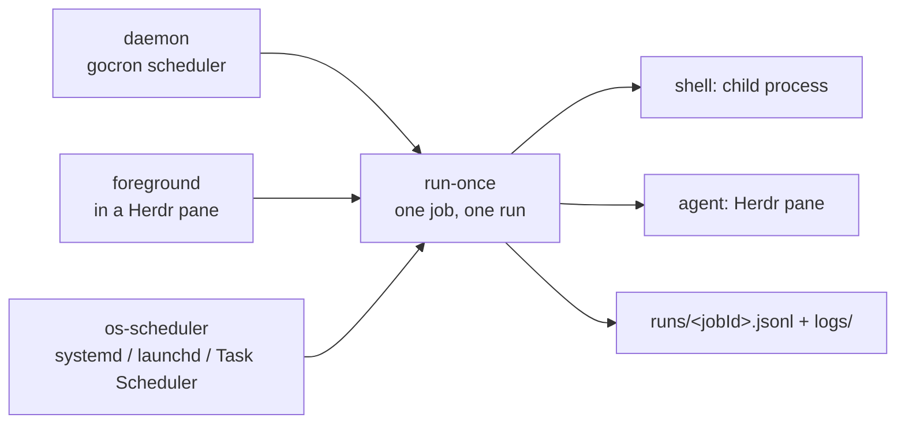

# herdr-cron

*English · [한국어](README.ko.md)*

A scheduler for automated work: `herdr-cron` runs shell commands and coding-agent prompts on a schedule, inside [Herdr](https://herdr.dev) panes. One Go binary, a JSON-first CLI a coding agent drives, and a mouse-driven TUI a human reads. Linux, macOS, Windows; pure Go, no cgo, no server, no database.

## What it is, and why

The agent-scheduling space is not empty — five shipping systems were read from primary sources before a line was written ([`docs/spec/01-overview.md`](docs/spec/01-overview.md) §1.1). What none of them does is the intersection. Nothing schedules work into a terminal multiplexer's long-lived panes, where a session survives detachment and an agent can be started, prompted and read with no client attached. Nothing treats a coding agent as its primary caller: a stable error-code vocabulary, a schedule dry run, a self-describing command tree and an embedded skill, instead of a slash command or an MCP tool a running task calls on itself. Nothing pairs that with a terminal UI for the human who has to answer "why did this not run at 03:00" — the alternatives ship a web server or ship nothing. Cross-platform is claimed rarely and delivered rarely. And nobody models the unattended failure that actually happens: an agent started in a directory it was never trusted with, sitting on an approval dialog forever, with no human in the building.

herdr-cron is that intersection, and only that: Herdr-native execution, agent-first control, human-first inspection, one binary, no server. It is not a workflow engine. There are no DAGs, no steps, no dependencies — a job is one command or one prompt, because the moment a scheduler grows dependencies you operate a second system.

## Install

### As a Herdr plugin

```sh
herdr plugin install huketo/herdr-cron
```

Installing builds the binary from source (the marketplace ships no binaries), registers a `[[startup]]` hook that brings the scheduler up on every server start, and adds four global actions plus the TUI as a pane surface. Then put the binary where an agent can find it:

```sh
herdr plugin action invoke huketo.herdr-cron.install-cli
```

From a working tree instead, for development — `plugin link` deliberately skips build commands, so build first:

```sh
make build && herdr plugin link .
```

### With the Go toolchain

The plugin manifest is optional. Everything except `kind: agent` jobs works with Herdr absent.

```sh
go install github.com/huketo/herdr-cron/cmd/herdr-cron@latest
```

### From a release archive

Each tag publishes archives for six targets — Linux, macOS and Windows on amd64 and arm64 — on the [GitHub Releases page](https://github.com/huketo/herdr-cron/releases). Download the one for your platform, verify it against `checksums.txt`, and put the extracted `herdr-cron` binary anywhere on `PATH`. The archive also carries the Agent Skill, so a harness can install it without running anything.

### So an agent can drive it

```sh
herdr-cron install-cli --with-skill
```

That links the running binary into a directory on `PATH` (`~/.local/bin` on Unix, `%LocalAppData%\Microsoft\WindowsApps` on Windows) and installs the bundled Agent Skill beside it, so a harness that scans skill directories picks up [`skills/herdr-cron/SKILL.md`](skills/herdr-cron/SKILL.md). Re-running it is a no-op. Choose the directory and replace an existing entry with `herdr-cron install-cli --dir ~/.local/bin --force --with-skill`.

## Quick start

Validate the schedule before you write it. This parses through the same code the daemon uses, so a job that would silently never fire fails here instead:

```sh
herdr-cron validate --schedule "17 3 * * 1-5" --timezone Asia/Seoul --next 5
```

Add a shell job:

```sh
herdr-cron job add --id build-smoke --schedule 30m --command 'go build ./... && go test ./...' --cwd ~/src/herdr --timeout 10m
```

Run it once, synchronously, in this process — no daemon involved:

```sh
herdr-cron run-once build-smoke
```

Add an agent job. A prompt implies `kind: agent`, a command implies `kind: shell`, and supplying both is a usage error:

```sh
herdr-cron job add --id nightly-deps --schedule "17 3 * * 1-5" --timezone Asia/Seoul --prompt 'Audit dependencies in this repo. If everything is current, reply with exactly HEARTBEAT_OK and stop.' --cwd ~/src/herdr --timeout 45m --no-op-marker HEARTBEAT_OK --max-runs-per-day 4
```

Look at what happened:

```sh
herdr-cron job get nightly-deps
herdr-cron run list --job nightly-deps --limit 10
herdr-cron run logs nightly-deps-20260901T181700Z --tail 200
```

Everything above prints JSON on stdout. Add `-o text` for the human rendering, which carries no compatibility promise.

## How it runs your jobs

One primitive executes work, and only it:

```sh
herdr-cron run-once <job-id>
```

It performs exactly one run in the calling process, synchronously, with no daemon, and exits with the code the run earned. Three interchangeable drivers sit above it and change no job semantics — pick the one that matches how your machine is actually used.

| Driver | How | What it buys | What it costs |
| --- | --- | --- | --- |
| `daemon` | `herdr-cron daemon --detach`, or the plugin's startup hook | The default. A new job takes effect immediately; catch-up, jitter, triggers and the circuit breaker all live here | A process must stay alive |
| `foreground` | `herdr-cron daemon --foreground`, typically in a Herdr pane | Logs on stderr, visible, trivially correct on Windows | Dies with its pane |
| `os-scheduler` | one systemd user timer / launchd LaunchAgent / Windows Scheduled Task per job, each exec'ing `run-once` | The OS answers "the laptop slept for six hours" for free, via systemd `Persistent=true` | One OS entry per job; two schedule forms cannot be translated exactly and are refused rather than approximated |



Register a driver with the OS:

```sh
herdr-cron service install --driver os-scheduler --now
herdr-cron service status --driver os-scheduler
herdr-cron service uninstall --driver os-scheduler --yes
```

Every artefact herdr-cron writes is marker-fenced, so `herdr-cron service status --driver daemon` can report `ok`, `stale` (hand-edited), `orphan` (the job left `jobs.yaml`), or `missing`, and uninstall sweeps exactly what it owns. It refuses to overwrite an unfenced file of the same name.

The scheduler's own liveness, the resolved roots, and the next occurrences come from one read-only command that never needs a daemon:

```sh
herdr-cron status
```

## Job definitions

Definitions live in an authored, comment-preserving, git-committable `jobs.yaml`. Writes go through a YAML node tree rather than a marshal round trip, so your comments and key order survive a `herdr-cron job update`; a write that would produce an invalid file is aborted before the rename, leaving the original byte-identical.

| OS | `jobs.yaml` | State root |
| --- | --- | --- |
| Linux | `~/.config/herdr-cron/jobs.yaml` | `~/.local/state/herdr-cron` |
| macOS | `~/Library/Application Support/herdr-cron/config/jobs.yaml` | `~/Library/Application Support/herdr-cron/state` |
| Windows | `%LocalAppData%\herdr-cron\config\jobs.yaml` | `%LocalAppData%\herdr-cron\state` |

Windows uses `LocalAppData`, not roaming `AppData`, on purpose: a roaming job database replicated onto a second machine fires jobs against absolute paths that do not exist there. `XDG_CONFIG_HOME` and `XDG_STATE_HOME` are honoured on all three platforms; `HERDR_CRON_CONFIG`, `HERDR_CRON_STATE_DIR` and `HERDR_CRON_HOME` override them; the flags override everything. `HERDR_PLUGIN_STATE_DIR` is deliberately ignored: the state root depends only on the machine, never on which front door started the process, so the plugin and the standalone CLI always share one schedule, one history, and one daemon lock.

A complete file, one job of each kind:

```yaml
version: 1

defaults:
  timezone: local
  timeout: 30m
  concurrency: skip
  jitter: auto
  catchup: latest
  catchup_window: 168h
  limits:
    max_consecutive_failures: 3
  notify:
    on: [failure, blocked, auto_disabled]

jobs:
  - id: nightly-deps
    name: Nightly dependency audit
    description: Check for outdated deps and report.
    enabled: true
    tags: [maintenance, repo:herdr]

    schedule:
      cron: "17 3 * * 1-5"      # :17, not :00 — off the hour everyone else picked
      timezone: Asia/Seoul
      catchup: latest
      catchup_window: 24h
      jitter: auto

    kind: agent
    agent:
      agent_kind: claude
      prompt: |
        Audit dependencies in this repo. If everything is current,
        reply with exactly HEARTBEAT_OK and stop.
      capture: transcript
      no_op_marker: HEARTBEAT_OK
      session: herdr-cron       # a dedicated Herdr session, not the human's
      worktree: false

    cwd: ~/src/herdr
    env:
      GIT_AUTHOR_NAME: herdr-cron
    timeout: 45m

    concurrency: skip
    limits:
      max_runs_per_day: 4
      max_consecutive_failures: 3
    notify:
      on: [failure, auto_disabled]

  - id: build-smoke
    name: Hourly build smoke
    enabled: true
    schedule:
      every: 30m
    kind: shell
    shell:
      command: go build ./... && go test ./...
    cwd: ~/src/herdr
    timeout: 10m
```

Unknown keys are a load error, not a warning — a typo in `catchup_window` must not silently disable catch-up. Durations are Go duration strings; a bare `timeout: 30` is rejected as ambiguous.

Exactly one of three schedule forms per job:

| Form | Example | Semantics |
| --- | --- | --- |
| `cron` | `cron: "17 3 * * 1-5"` | 5 or 6 fields (6 puts seconds first). Descriptors `@daily`, `@hourly`, `@weekly`, … are accepted; `@reboot` is rejected. A `CRON_TZ=` prefix inside the expression beats the `timezone` field. |
| `every` | `every: 30m` | Fixed interval, measured from the scheduler's start or from `start_at`. |
| `at` | `at: 2026-12-24T18:00:00+09:00` | One absolute instant. After it fires, the job is complete and is never scheduled again. |

The same three shapes go into one flag on the CLI — a cron expression, a descriptor, a duration, or an RFC 3339 instant — disambiguated by shape, because an agent forced to choose between three flags will choose wrong.

## Safety defaults

Read this before you leave it running unattended. Every default below is chosen to cost you money slowly rather than quickly.

- **Jitter is on (`jitter: auto`).** The offset is `FNV1a64(job.id) mod min(interval/2, 30m)` — deterministic, so the same job always starts at the same second and the predicted next run stays honest. It exists because six agent jobs at `0 9 * * *` would otherwise launch six agents into the same repository in the same second. Jitter never applies to a manual run.
- **`max_runs_per_day` defaults to 24 for agent jobs and 0 (unlimited) for shell jobs.** The asymmetry is intentional: a shell job is nearly free and an agent job is not. Exceeding the limit records a `skipped` run with reason `limit_exceeded`, so the refusal is visible in history rather than silent.
- **`max_consecutive_failures: 3` auto-disables a job.** Three consecutive `failure`, `timeout` or `blocked` outcomes flip an override to disabled with `disabledReason: auto_failures` and fire a notification. `herdr-cron job resume` clears it. This is the money circuit breaker, and it is a deliberate invention — no surveyed scheduler has one, and the two hosted products that needed it bolted it on afterwards.
- **`catchup: latest`, window 168h.** After downtime, exactly one run for the most recently missed occurrence; anything older is discarded. `off` and `all` exist per job. Twenty seconds of downtime on a five-second job produces one catch-up run, not four — and opening a laptop after a weekend does not launch a queue of agents into one repo.
- **`concurrency: skip`.** An occurrence arriving while the previous run is still going is recorded as a `skipped` run with reason `overlap`, not dropped. Recording it is what makes "why did this not run at 03:00" answerable at all.
- **Every agent prompt gets a preamble, and it is not configurable.** Prepended verbatim, before your text:

  > You are being run by herdr-cron on a schedule. There is no human watching this session. Do not ask questions; if a required detail is missing, make the safest reasonable assumption or stop and explain what was missing. Do not wait for approval. When you are done, state the outcome in one line.

  Its absence is the documented cause of a scheduled agent stalling forever on a question. Write prompts assuming it is there.
- **`blocked` is terminal and is never retried.** An agent sitting on a trust or approval dialog with nobody present will not resolve itself; retrying burns the daily limit and changes nothing. It always notifies, it increments the failure counter, and it is the only outcome with an exit code of its own.
- **Retry is off by default** (`max_attempts: 1`). One attempt of an LLM invocation costs money, so the 25-attempt defaults of job queues built for webhook deliveries are the wrong shape here.

## For agents

The CLI is the primary interface and JSON is its default. Every response is one envelope with `id` and exactly one of `result` or `error`:

```json
{"id": "cli:job:list", "result": {"type": "job_list", "jobs": []}}
{"id": "cli:job:get", "error": {"code": "job_not_found", "message": "no job with id \"nightl-deps\"", "hint": "did you mean \"nightly-deps\"?"}}
```

`result.type` names the payload shape and is always present. An error envelope goes to stdout *and* a one-line summary goes to stderr, so a piped caller keeps its structured data. The single documented exception is `herdr-cron run logs`, which streams raw log text because it is a stream; with `-o json` each line is wrapped as `{"type":"log_line","runId":…,"line":…}`.

Exit codes:

| Code | Meaning |
| --- | --- |
| `0` | Success. For a waited run: it finished `success`, `no_op`, or `skipped`. |
| `1` | Failure, or the run finished `failure`, `timeout`, or `cancelled` (`error.code` is `run_failed`). |
| `2` | Usage error — unknown flag, missing argument, bad value. |
| `3` | The run finished `blocked`. A human is required; do not retry. |

A `skipped` run exits 0 deliberately: under the `os-scheduler` driver, marking a systemd unit failed because an overlap was skipped would train you to ignore the unit.

Branch on `error.code`, never on `error.message`. The vocabulary is stable — new codes may be added, existing ones never change meaning:

| Code | Meaning |
| --- | --- |
| `usage` | Bad flags or arguments. |
| `config_invalid` | `jobs.yaml` failed validation; `error.details` carries per-job messages. |
| `config_conflict` | The file changed between read and write. Retry. |
| `job_not_found`, `job_exists`, `run_not_found` | Identity errors. |
| `daemon_unreachable` | No live daemon claimed the trigger. Run the job in this process instead. |
| `daemon_already_running` | The single-instance lock is held. |
| `herdr_unavailable` | An agent operation with no `herdr` binary or no reachable server. |
| `agent_blocked` | The agent stopped at an approval or question UI. |
| `cwd_missing` | The job's working directory does not exist. |
| `limit_exceeded` | A run was refused by `limits`. |
| `run_failed` | A waited run reached a terminal failure; `error.details.run` carries the record. |
| `io_error`, `internal` | Filesystem failure; a bug. |

Discover the surface instead of guessing at it. `herdr-cron schema` prints the whole command tree as JSON — every command, every flag, its type, default and required-ness — and `herdr-cron schema --command "job add"` narrows it to one command:

```sh
herdr-cron schema
herdr-cron --skill
```

`herdr-cron --skill` prints the bundled Agent Skill, byte-identical to the installed copy (a test fails the build if that ever stops being true), which makes skill/binary version skew impossible. Read it: it teaches *when* to schedule, not only how.

One rule with a reason behind it: bare `herdr-cron` on a TTY launches the TUI, and bare `herdr-cron` without a TTY is a usage error rather than a hang. An agent that pipes a full-screen program is worse off than an agent that gets an error.

## Command reference

Every command accepts these:

| Global flag | Default | Meaning |
| --- | --- | --- |
| `--output`, `-o` | `json` | `json` or `text`. Only `json` is a stable interface. |
| `--config` | per-OS, see above | Path to `jobs.yaml`. |
| `--state-dir` | per-OS, see above | State root. |
| `--quiet`, `-q` | off | Suppress warnings on stderr. Never suppresses errors. |

| Command | Purpose | Notable flags |
| --- | --- | --- |
| `herdr-cron` | Schedule automated work for coding agents. Bare, on a TTY, launches the TUI | `--skill`, `--version` (`-V`) |
| `herdr-cron completion` | Print a shell completion script for `bash`, `zsh`, `fish`, or `powershell` | — |
| `herdr-cron daemon` | Run the schedule | `--detach`, `--foreground` |
| `herdr-cron install-cli` | Link this binary into a directory on `PATH` | `--dir`, `--force`, `--with-skill` |
| `herdr-cron job` | Manage job definitions | (group) |
| `herdr-cron job add` | Add a job to `jobs.yaml` | `--id`, `--schedule`, `--command`, `--prompt`, `--name`, `--description`, `--cwd`, `--env`, `--tag`, `--timeout`, `--timezone`, `--catchup`, `--concurrency`, `--agent-kind`, `--session`, `--no-op-marker`, `--max-attempts`, `--max-runs-per-day`, `--paused`, `--dry-run` |
| `herdr-cron job cancel` | Cancel the job's running execution | — |
| `herdr-cron job get` | Show one job with its next runs and recent history | — |
| `herdr-cron job list` | List jobs | `--state`, `--kind`, `--tag` |
| `herdr-cron job pause` | Stop scheduling a job without editing `jobs.yaml` | — |
| `herdr-cron job resume` | Resume a paused job, clearing an auto-disable | — |
| `herdr-cron job rm` | Remove a job from `jobs.yaml` | `--yes`, `--purge` |
| `herdr-cron job run` | Ask the daemon to run a job now | `--wait` |
| `herdr-cron job update` | Change fields of an existing job | every flag `job add` takes, except the identifier |
| `herdr-cron reload` | Ask the daemon to re-read `jobs.yaml` | — |
| `herdr-cron run` | Inspect run history | (group) |
| `herdr-cron run get` | Show one run record | — |
| `herdr-cron run list` | List runs, newest last | `--job`, `--status`, `--limit`, `--since` |
| `herdr-cron run logs` | Print a run's captured output | `--tail`, `--follow` |
| `herdr-cron run-once` | Execute exactly one run of a job in this process | — |
| `herdr-cron schema` | Print the command tree as JSON | `--command` |
| `herdr-cron service` | Register herdr-cron with the OS scheduler | (group) |
| `herdr-cron service install` | Install the scheduler as an OS service | `--driver`, `--now` |
| `herdr-cron service status` | Report what is registered and whether the OS agrees | `--driver` |
| `herdr-cron service uninstall` | Remove every artefact herdr-cron registered | `--driver`, `--yes` |
| `herdr-cron status` | Report daemon liveness, roots, and the next occurrences | — |
| `herdr-cron validate` | Validate a schedule expression or the whole `jobs.yaml` | `--schedule`, `--timezone`, `--next` |

What needs a running daemon: `herdr-cron job run`, `herdr-cron job cancel`, and `herdr-cron reload`, which fail `daemon_unreachable` without one. Everything else is file reads and file writes. `herdr-cron job pause` and `herdr-cron job resume` write a separate override file under its own lock precisely so they work with no daemon — and so a pause never rewrites your YAML.

## The TUI

Bare `herdr-cron` on a TTY opens the human surface — three screens and a modal, Bubble Tea v2 on the alt screen, with cell-motion mouse reporting on by default.

- **Job list.** One row per job: a status glyph (`●` enabled, `○` disabled by you, `⊘` disabled by the circuit breaker), name, schedule, a countdown to the next run, and the last outcome. Click a row to select it; click it again within 400 ms to open it. Click the glyph to pause or resume — that writes the override file, and `jobs.yaml` is byte-identical afterwards. Click the trailing `▶` to run the job now. The wheel scrolls.
- **Job detail.** One read supplies the resolved job, its next five fire times, and its ten most recent runs, so opening a job costs one round trip rather than four. Buttons run, pause, and delete; delete opens a confirm modal with an opt-in purge checkbox and never deletes on the first click.
- **Run history and output.** Runs with duration, status, trigger and exit code beside the captured log. `[copy]` puts the output on the system clipboard, which is the designed answer to mouse reporting killing native terminal selection.
- **`m` toggles the mouse.** Turning reporting off restores your terminal's own selection and copy, and it is the fallback when a multiplexer swallows the events. The key binding is mandatory rather than a nicety: once mouse reporting is off the on-screen badge cannot be clicked, so the help bar advertises `m` at all times.
- **Keyboard.** `tab` moves focus between the two panes of a screen, and the highlighted border is the pane the keys reach: `↑/↓` move a row or a line, `pgup/pgdn` a page, `home/end` the ends. A pane holding more than it shows says so on its last row — `▲ 42% ▼` for text, `▲ 3-14/40 ▼` for a list — so a pane with something below the fold is never mistaken for a finished one.

Every mouse affordance has a keyboard equivalent in the help bar, and no destructive action is keyboard-only. The TUI owns no scheduler: quitting it, killing it, or closing the terminal has no effect on what runs.

## Documentation

- [`docs/spec/`](docs/spec/) — the normative specification. [`README.md`](docs/spec/README.md) is the index, the decision record D1–D8, and the honest implementation-status table; [`01-overview.md`](docs/spec/01-overview.md) orients; [`03-job-model.md`](docs/spec/03-job-model.md), [`04-storage.md`](docs/spec/04-storage.md) and [`05-cli.md`](docs/spec/05-cli.md) are the contracts everything else is written against.
- [`docs/research/`](docs/research/) — the primary-source evidence the spec rests on. Every document is pinned to a commit or a URL and carries its own "Could not verify" section.
- [`docs/adr/0001-run-once-core-with-three-drivers.md`](docs/adr/0001-run-once-core-with-three-drivers.md), [`0002-files-only-ipc.md`](docs/adr/0002-files-only-ipc.md), [`0003-agent-skill-distribution.md`](docs/adr/0003-agent-skill-distribution.md) — the three decisions a reader is most likely to want to argue with.
- [`CONTEXT.md`](CONTEXT.md) — domain vocabulary. [`CONTRIBUTING.md`](CONTRIBUTING.md) — how to build, test, and shape a commit.
- [`skills/herdr-cron/SKILL.md`](skills/herdr-cron/SKILL.md) — the bundled Agent Skill, with references for the [job schema](skills/herdr-cron/references/job-schema.md), the [JSON shapes](skills/herdr-cron/references/json-shapes.md), and [troubleshooting](skills/herdr-cron/references/troubleshooting.md).

## Status and limitations

Version 0.1.0. The specification is implemented; the parts below are the parts that are not — stated here so nothing surprises you at 03:00.

- **Only Linux is verified by running.** Every non-Linux claim — service registration, mouse delivery, headless agent startup, timer behaviour across suspend — is read from source or documentation, not executed. All six release targets cross-compile, which is a different statement from "it works there".
- **Worktree isolation is not shipped.** `agent.worktree` is specified and parsed; a run always happens in the job's `cwd`.
- **Retry backoff is not wired.** `max_attempts` is honoured as 1; a higher value does not yet schedule a second attempt.
- **The TUI has no `/` filter yet**, and tag filters match exactly — no prefix, no glob.
- **Mouse forwarding inside a Herdr pane is untested** and may conflict with Herdr's own mouse handling. If it does, press `m` and use the keyboard; that path is why the toggle exists.
- **Agent kinds other than `claude` have never been started unattended.** Their startup dialogs are unknown — which is the class of failure the trust pre-flight and the `blocked` outcome exist to catch, but the pre-flight is specified per kind and only one kind has been exercised.

## Licence

MIT. See [LICENSE](LICENSE).
