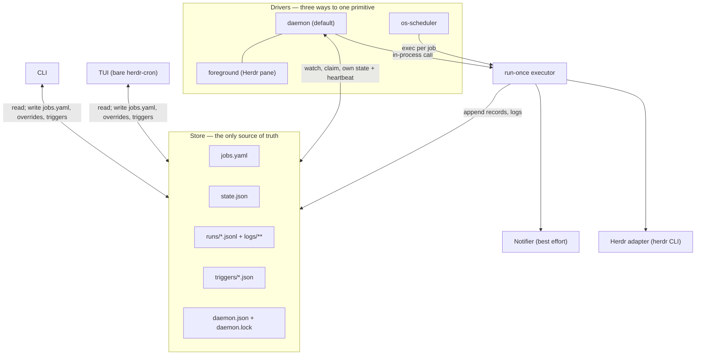

# Architecture

Normative. RFC 2119 keywords. This is the file [`04-storage.md`](04-storage.md) §7 and
[`05-cli.md`](05-cli.md) §3.4/§3.5 cite by section number; the numbering below is fixed. It
implements D1 (hybrid: `run-once` as the single primitive, three drivers above it), D6 (files-only
IPC) and D8 (always write a log and a JSONL record; notify best-effort), from
[`README.md`](README.md). Schema: [`03-job-model.md`](03-job-model.md). Layout: `04-storage.md`.
Commands: `05-cli.md`.

## 1. Components



| Component | Owns | MUST NEVER |
| --- | --- | --- |
| **CLI** | Argument parsing, the envelope of `05-cli.md` §2, `jobs.yaml` read-modify-write under `jobs.yaml.lock`, `enabled` overrides for `job pause`/`resume`, trigger-file creation. | Construct a gocron `Scheduler`; hold a long-lived lock; write `runs/*.jsonl`, `logs/**` or `daemon.json`. |
| **TUI** | Rendering and mouse hit testing over the CLI's read paths; mutations reuse the CLI's code paths (triggers, `jobs.yaml`, overrides). | Own a scheduler; be a prerequisite for any job firing. |
| **Daemon** | One gocron `Scheduler`, `daemon.lock`, `daemon.json`, `state.json`, the `jobs.yaml` watcher + poll, trigger claiming, the reconciliation pass, the sleep detector, retention. | Write `jobs.yaml` (`04-storage.md` §3); be required by a read command; decide a run's outcome — that is the executor. |
| **run-once executor** | One run: guards, the `running` record, the log file, the child process or Herdr agent, the terminal record, the notifier call. | Consult a daemon: no `daemon.json` read, no `daemon.lock` test, no trigger files, no timers. |
| **Store** (files) | The truth: definitions, effective `enabled`, catch-up watermark, history, logs. | Nothing — it is passive; no process may cache it across a command boundary. |
| **Herdr adapter** | Every `herdr` subprocess: session/workspace/tab creation, `agent start`, `agent prompt --wait`, `agent read`, `pane run`, `pane wait-output`, trust pre-flight ([`07-herdr-integration.md`](07-herdr-integration.md)). | Sit on the path of a `kind: shell` run (`03-job-model.md` §3.1); be linked as a library — it is a CLI boundary. |
| **Notifier** | Running `notify.command` (default `herdr notification show`) after a terminal record exists. | Change a status, delay a record, or fail a run. On a headless server `notification show` provably returns `{"shown": false, "reason": "no_foreground_client"}` (`docs/research/2026-09-02-herdr-plugin-integration.md` §9.5) — the normal case. |

### 1.1 Invariants

**I1 — The store holds the truth, not any process.** Every decision is recomputed from
`jobs.yaml` + `state.json` + `runs/<jobId>.jsonl`; no fact may live only in memory. Forced by
evidence: gocron's `Update` "removes the old job and installs a brand new one under the same UUID"
and thereby **discards all in-memory run history for that job**, and `internalJob` is not
serialisable — "A store, and it is the source of truth… `Update`'s history wipe and the
unserialisable `internalJob` make this non-optional"
(`docs/research/2026-09-02-gocron-scheduling-engine.md` §2, §7, "Implications" item 1).

**I2 — The TUI never owns a scheduler.** Quitting it MUST NOT stop the schedule; launching it MUST
NOT start one. Same section: "**TUI**: a client of the daemon over IPC, not an owner of a
`Scheduler`. Owning one would mean the schedule stops the moment the user quits the TUI."
herdr-cron replaces "over IPC" with "over the store" (D6); the ownership rule is unchanged.

**I3 — No `Scheduler` in a short-lived process.** `NewScheduler` starts a goroutine, `Start()`
arms timers, and `NextRun()` is zero until `Start()` returns and then computed from *now*, not
from history (`gocron` §2, §5). The carve-out is the parser: `NewDefaultCron(withSeconds)` is
exported "for use outside the scheduling of a job" `[GC job.go:223-225]`, so `validate --schedule`
and every `nextRunAt` in the CLI and TUI use it — which makes the CLI's verdict and the daemon's
behaviour identical, `CRON_TZ=` precedence included (`03-job-model.md` §2).

**I4 — Exactly one writer per file** (`04-storage.md` §9); where that table says "daemon only",
read "the executing scheduler process", since under `os-scheduler` `run-once` is that process.
**I5 — A missing daemon degrades, never breaks**: every command in `05-cli.md` §4's "No" column
works with no daemon installed, and `run-once` executes with none at all.

## 2. The `run-once` core and the three drivers

### 2.1 Contract

`herdr-cron run-once <job-id>` is one run of one job, synchronously, in the calling process, with
no timer and no daemon. It is the only code path that executes a job: the daemon calls the same
function in-process, the OS scheduler calls this command.

**Reads**, in order: (1) roots per `04-storage.md` §1; (2) `<config>/jobs.yaml`, validated at
levels 1–3 of `03-job-model.md` §7 — an invalid file fails with `config_invalid` and writes **no**
run record, because the job asked for may not be the job in the file; (3) `state.json` for
effective `enabled` (`03-job-model.md` §5), `consecutiveFailures`, `runsToday`; (4) the tail of
`runs/<jobId>.jsonl`, to detect a live overlapping run and to test `runId` idempotence for
catch-up (`03-job-model.md` §4.1).

**Writes**, in order: (1) `state.lastScheduledAt`, before execution, when the trigger is
`scheduler` or `catchup` (`03-job-model.md` §4.2); (2) the `running` record appended to
`runs/<jobId>.jsonl`; (3) `logs/<jobId>/<runId>.log`, incrementally as output arrives
(`04-storage.md` §6); (4) the terminal record, appended; (5) `state.json` — `lastRunId`,
`lastStatus`, `lastFinishedAt`, `consecutiveFailures`, `runsToday`, plus the `auto_failures`
override when `max_consecutive_failures` is reached (`03-job-model.md` §4.5); (6) the notifier
subprocess, after step 4, when the terminal status is in `notify.on`.

**Locking.** An advisory lock (`flock` / `LockFileEx`) on `<state>/runs/<jobId>.jsonl` — the file
that already exists per job, whose single-writer property (`04-storage.md` §9) is what is being
enforced. Non-blocking for `skip` and `cancel_previous` (failure under `skip` writes a `skipped`
record with reason `overlap`, `03-job-model.md` §4.3, and exits 0); blocking, bounded by the job
`timeout`, for `queue`; not taken for `allow`, the only mode in which two processes may append
concurrently — safe because appends are single `write` syscalls under `O_APPEND`. Held across the
whole run including the terminal write, so a crash releases it with the OS. `cancel_previous`
cannot cancel another process's run: when the holder is a different pid, `run-once` degrades to
`skip`/`overlap`; under the `daemon` driver it works as written, because the running execution is
a goroutine the daemon owns.

**Trigger provenance and jitter.** `trigger: "manual"` unless `HERDR_CRON_TRIGGER` is set to
`scheduler`, `catchup`, `retry` or `startup` (the enum of `03-job-model.md` §6), which §4's
generated OS entries do; an environment variable rather than a flag keeps `05-cli.md` §3.5's
surface intact. Jitter is never applied here — `03-job-model.md` §2.1 restricts it to `scheduler`
and `catchup`, the daemon applies it before the call, and under `os-scheduler` it is baked into
the generated entry (§4).

**Exit codes** (`05-cli.md` §2.2):

| Terminal outcome | Exit | Envelope |
| --- | --- | --- |
| `success`, `no_op` | 0 | `result.type: "run_result"` with the run record. |
| `skipped` (`overlap`, `limit_exceeded`, `disabled`, `catchup_capped`, `superseded`) | 0 | `result.type: "run_result"`, `status: "skipped"`, `reason` set. Exit 0 because the command did what it was asked — a daily-limit skip MUST NOT mark a systemd unit failed. |
| `failure`, `timeout`, `cancelled` | 1 | `error.code`: `cwd_missing`, `herdr_unavailable` or `io_error` where they apply, else `run_failed` (Open point 2), with the record under `error.details.run`. |
| `blocked` | 3 | `error.code: "agent_blocked"`. Retrying is pointless; escalate. |
| unknown job / invalid config / bad flags | 1 / 1 / 2 | `job_not_found` / `config_invalid` / `usage`. |

**It never consults a daemon.** No `daemon.json` read, no `daemon.lock` test, no trigger files, no
refusal to run because a daemon is or is not live; the only cross-process coordination is the
per-job flock. That is what makes the drivers interchangeable and `05-cli.md` §4's last row
("`run-once` — No. It *is* the runner.") true.

### 2.2 The three drivers

Same primitive; they differ only in **who holds the clock**.

- **`daemon` (DEFAULT)** — a long-lived process owning one gocron `Scheduler` (§3).
- **`foreground`** — `herdr-cron daemon --foreground`: the same code path with logs on stderr
  instead of the log file (`05-cli.md` §3.3), for a Herdr pane. The research's framing holds
  verbatim: "a `herdr-cron run --once` / `--fg` mode, where a foreground process *is* the daemon
  for its lifetime… same code path, different lifetime — as long as the store, not the process,
  holds the truth" (`gocron` "Implications for herdr-cron").
- **`os-scheduler`** — no herdr-cron process between runs: one OS entry per job, each exec'ing
  `herdr-cron run-once <id>` (§4).

### 2.3 Comparison

| | `daemon` (default) | `foreground` | `os-scheduler` |
| --- | --- | --- | --- |
| **`job add` takes effect** | Immediately — fsnotify on `<config>` plus a 5 s stat poll (`04-storage.md` §3.1); "trivially solved… the option's decisive advantage" (`docs/research/2026-09-02-prior-art-and-domain-model.md` Q7(a)). | Immediately, same watcher. | **Not until `service install` re-runs.** Declared state and OS state can diverge (`prior-art` Q7(c)); hence §4.4. |
| **Laptop sleeps 6 h** | Detected, then reconciled. gocron replays nothing — `advancePastNow` "walks the schedule forward, discarding every intermediate tick", and Go's `CLOCK_MONOTONIC` "does not count time that the system is suspended", so one timer fires late and the schedule resumes from `next(now)` (`gocron` §8). Catch-up is herdr-cron's own pass (`03-job-model.md` §4.2). | Same as `daemon`. | **Correct for free on Linux.** systemd `Persistent=`: "the service unit is triggered immediately if it would have been triggered at least once during the time when the timer was inactive", and for sleep "if a calendar timer elapsed more than once while the system was continuously sleeping the timer will only result in a single service activation" (`prior-art` Q3, quoting systemd.timer 261.2) — `catchup: latest` implemented by the OS. macOS and Windows do not match it (§4.2, §4.3). |
| **Windows** | Works, and there is no transport to break: D6 makes IPC a directory of files, avoiding the socket-vs-named-pipe split that forced pueue to TCP+TLS (`prior-art` Q7(a)). Auto-start via `schtasks /sc ONLOGON` (`docs/research/2026-09-02-agent-skill-and-cli-ux.md` B5). | "Easiest of the three — it's just a process" (`prior-art` Q7(b)). | A third backend with a different model; `@dortort/scheduler` supports "macOS (launchd) or Linux (crontab)" and nothing else (`prior-art` Q7(c)). Implemented in §4.3, at the cost of a third test matrix. |
| **Terminal closes** | Nothing dies — detached at start (`--detach`, §3.1) or started by the OS. | **The schedule stops.** Herdr pane persistence mitigates but does not remove the cost; `prior-art` Q7(b) quotes Claude Code: "Closing the terminal or letting the session exit stops them firing." | Nothing dies — no process exists between runs. |
| **User must install** | Nothing, to run by hand. To survive reboot: `service install --driver daemon` → systemd user unit (+ `loginctl enable-linger`), LaunchAgent, or `schtasks /sc ONLOGON`. No admin anywhere (B5 comparison table). | Nothing: a Herdr session and a pane. | `service install --driver os-scheduler`, plus §4's per-OS caveats. No admin. |
| **"Is it running now?"** | `daemon.json` heartbeat + `daemon.lock` (`04-storage.md` §7). | Same. | The per-job flock (§2.1) — "each fire is a fresh process, so 'is it running now?' needs a lock file" (`prior-art` Q7(c)). |

Default is `daemon`: immediacy of `job add` is what an agent caller notices every time, and
catch-up must exist for it regardless, so `Persistent=true` is a Linux-only bonus, not a portable
answer.

## 3. Daemon lifecycle

Every gocron identifier below is copied from `docs/research/2026-09-02-gocron-scheduling-engine.md`
§2, §3, §4 and §6, which quote `go-co-op/gocron/v2` source directly.

### 3.1 Startup

`herdr-cron daemon [--foreground] [--detach]`. `--detach` re-execs the binary as
`herdr-cron daemon` with detached stdio, polls `daemon.json` until `heartbeatAt` is fresh (< 60 s,
`04-storage.md` §7) or 10 s elapse, then exits 0; exits 0 as a no-op when `daemon.lock` is already
held; exits 1 with `io_error` if the child dies first. `--detach` and `--foreground` are mutually
exclusive (exit 2). This is the form a Herdr `[[startup]]` hook uses, because such a hook must
exit ([`07-herdr-integration.md`](07-herdr-integration.md) §8).

Ordered steps; each MUST complete before the next.

1. **Acquire `daemon.lock`** — `O_CREAT|O_EXCL` plus `flock`/`LockFileEx` held for the process
   lifetime (`04-storage.md` §7). Failure is fatal: exit 1, `daemon_already_running`. gocron's
   `Locker` is a per-run distributed lock and explicitly not this (`gocron` §7).
2. **Load and validate `jobs.yaml`** (levels 1–3, `03-job-model.md` §7). Failure does NOT exit:
   record `configError` in `daemon.json`, schedule nothing, keep watching, so fixing the file
   recovers without a restart.
3. **Close out orphaned `running` records** — one with no terminal partner and no live process
   becomes `status: "failure"`, `reason: "daemon_died"` (`04-storage.md` §5); GC trigger files
   older than 5 minutes (`04-storage.md` §8 step 4).
4. **Build the scheduler** and register every enabled job.

```go
sched, err := gocron.NewScheduler(
    gocron.WithLocation(time.Local),          // default is time.Local anyway [GC scheduler.go:205]
    gocron.WithStopTimeout(30*time.Second),   // default 10s [GC scheduler.go:1357]
    gocron.WithLogger(lg),                    // [GC scheduler.go:1342]
    gocron.WithMonitorStatus(hist),           // [GC scheduler.go:1380]
    gocron.WithGlobalJobOptions(              // [GC scheduler.go:1254]
        gocron.WithEventListeners(
            gocron.AfterJobRunsWithPanic(hist.OnPanic),
            gocron.BeforeJobRuns(hist.OnBeforeJobRuns),
        ),
    ),
)
```

Verbatim signatures relied on:

```go
func NewScheduler(options ...SchedulerOption) (Scheduler, error)      // [GC scheduler.go:182]
func WithEventListeners(eventListeners ...EventListener) JobOption    // [GC job.go:755]
func AfterJobRunsWithPanic(eventListenerFunc func(jobID uuid.UUID, jobName string, recoverData any)) EventListener
func BeforeJobRuns(eventListenerFunc func(jobID uuid.UUID, jobName string)) EventListener
func WithIdentifier(id uuid.UUID) JobOption                           // [GC job.go:1011]
func WithName(name string) JobOption                                  // [GC job.go:783]
func WithSingletonMode(mode LimitMode) JobOption                      // [GC job.go:821]
func WithStopAt(option StopAtOption) JobOption                        // [GC job.go:973]
func CronJob(crontab string, withSeconds bool) JobDefinition          // [GC job.go:324-329]
func DurationJob(duration time.Duration) JobDefinition                // [GC job.go:350-354]
func OneTimeJob(startAt OneTimeJobStartAtOption) JobDefinition        // [GC job.go:715-719]
func OneTimeJobStartDateTime(start time.Time) OneTimeJobStartAtOption // [GC job.go:699]
func NewTask(function any, parameters ...any) Task                    // [GC job.go:147,154-161]

job, err := sched.NewJob(                     // NewJob(JobDefinition, Task, ...JobOption) (Job, error)
    def, // CronJob / DurationJob / OneTimeJob per 03-job-model.md §2
    gocron.NewTask(func(ctx context.Context) error { return exec.RunOnce(ctx, jobID, trig) }),
    gocron.WithIdentifier(uuidFromJobID(jobID)),           // stable across restarts
    gocron.WithName(jobID),
    gocron.WithSingletonMode(gocron.LimitModeReschedule),  // 'skip'; LimitModeWait for 'queue'
)
```

- The task's first parameter MUST be `context.Context` — "If the function's first parameter is
  `context.Context`, gocron injects the job context automatically" `[GC scheduler.go:1044-1055]`,
  and shutdown cancels job contexts first (§3.4). Dispatch is `reflect.Value.Call`, so there is no
  compile-time safety: exactly one task shape, closing over its own payload (`gocron` §3).
- `WithIdentifier` MUST be derived deterministically from the job id so restarts reproduce stable
  UUIDs; gocron checks no collisions — "a duplicate id will silently overwrite the map entry"
  `[GC scheduler.go:781]` — so herdr-cron's id-uniqueness validation is the only guard.
  `WithSingletonMode` maps `concurrency: skip` → `LimitModeReschedule` (the overlapping tick is
  dropped) and `queue` → `LimitModeWait` (`gocron` §4; `03-job-model.md` §4.3).
- A `nil` error from `NewJob` does not prove registration: after `Shutdown`, "**`NewJob` after
  `Shutdown` returns a non-nil `Job` and a `nil` error** while scheduling nothing" (`gocron` §2),
  so the daemon MUST track scheduler liveness itself.

5. **Start the heartbeat** — atomic rewrite of `daemon.json` every 15 s, `driver` set to `daemon`
   or `foreground`. It precedes anything that executes a job: liveness is the lock plus the
   heartbeat (`04-storage.md` §7), the lock is already held, and a catch-up run of a `kind: agent`
   job can take minutes — long enough for `daemon --detach` to stop waiting and call a healthy
   start a failure while `status` reports the running daemon as stopped.
6. **Reconciliation pass** — `03-job-model.md` §4.2, `trigger: "startup"` or `"catchup"`, writing
   `lastScheduledAt` before anything executes.
7. **`sched.Start()`** — blocks briefly and returns "once scheduling is live, not before";
   `NextRun()` is zero until then, and a second call logs a warning and returns (`gocron` §2).
8. **Start the watchers** — fsnotify plus the 5-second stat poll on `jobs.yaml` and `triggers/`,
   and the 30-second clock watch that detects sleep and resume (`03-job-model.md` §4.2).

### 3.2 Mandatory listener rules

**(a) A panic kills the process unless `AfterJobRunsWithPanic` is registered.**
`callJobFuncWithParams` has no `recover`; the wrapper is applied only when that listener is
non-nil `[GC executor.go:524-528]`, verified with two child processes — "without it the child died
(`exit=exit status 2`, `panic: boom`); with it the child logged `panic listener saw: boom` three
times and exited `0`" (`gocron` §6). herdr-cron **MUST** register it on every job via
`WithGlobalJobOptions` (§3.1 step 5); global options are applied before per-job options, so no
per-job option can remove it `[GC scheduler.go:1025-1037]`. The wrapper also converts the panic
into a returned `ErrPanicRecovered`, so the error listener fires too — a panic produces **both**
callbacks, and the history writer MUST deduplicate on `runId` rather than emit two records.

**(b) `BeforeJobRuns` blocks the job's own next tick, so no listener may do I/O.** The reschedule
is step 6 of `executor.runJob`, downstream of `beforeJobRuns` at step 2, so a 500 ms
`BeforeJobRuns` on a 200 ms job pushed the second tick to 600 ms and "three ticks were silently
swallowed" (`gocron` §6). `jobsOutForRescheduling` and `jobsOutCompleted` are **unbuffered**
channels read by the single scheduler goroutine, so a slow listener also back-pressures the shared
singleton/limit-mode runner. Therefore every listener and every `MonitorStatus` method MUST be one
non-blocking send on a buffered channel: no `write`, no `fsync`, no `rename`, no subprocess.

**The history write happens in the task function**, not in a listener — the `exec.RunOnce` closure
of §3.1, the same executor `run-once` runs. It owns the run context, the log file and both JSONL
records, and sits at step 8 of `runJob`, downstream of the reschedule, so its I/O cannot perturb
cadence. gocron's hooks carry only what the task cannot observe: `Monitor.IncrementJob` with
status `Skip` (elector/locker refusal) and `SingletonRescheduled` (a dropped overlapping tick) —
"exactly the two 'why didn't my job run' cases a user will ask about" (`gocron` §6) — plus the
panic capture. Each enqueues one event; one history-writer goroutine does the disk I/O and is the
only writer of `runs/*.jsonl` (I4).

### 3.3 Steady state

| Activity | Mechanism | Cadence |
| --- | --- | --- |
| Config reload | fsnotify on `<config>` — the **directory**, because atomic rename replaces the inode — debounced 200 ms, plus an mtime+size stat poll (`04-storage.md` §3.1) | events / 5 s |
| Trigger consumption | fsnotify on `<state>/triggers/` plus the same poll; claim by renaming `<ulid>.json` → `<ulid>.claimed`, act, write `<ulid>.result`, delete (`04-storage.md` §8) | events / 5 s |
| Heartbeat | atomic replace of `daemon.json` | 15 s |
| Clock watch | wall-clock comparison against the previous tick; a jump > 90 s triggers the reconciliation pass (`03-job-model.md` §4.2) | 30 s |

A reload diffs the resolved job set against the registered gocron jobs: `RemoveJob(id)` for
removals, `NewJob(...)` for additions, `Update(id, def, task, opts...)` for changes. Two caveats
are load-bearing (`gocron` §2): `RemoveJob` "returns **without waiting** for the removal to land"
and does not wait for a running task, so the daemon MUST let an in-flight run finish and write its
own terminal record; `Update` "discards all in-memory run history for that job", harmless here
because of I1. A reload failing validation is rejected wholesale (`04-storage.md` §3.1).

### 3.4 Shutdown

Signals: `SIGTERM`/`SIGINT` on Unix via `signal.NotifyContext`; on Windows `os.Interrupt`
(`CTRL_C_EVENT`/`CTRL_BREAK_EVENT`) and, when installed as a service, the SCM stop path —
`kardianos/service`'s `Stop(s Service) error`, which "should not take more then a few seconds to
execute" (`agent-skill-and-cli-ux` B5). `SIGHUP` is NOT reload; use `herdr-cron reload`.

1. Stop the watchers, the poll and the heartbeat writer, then write one final `daemon.json` with a
   fresh `heartbeatAt` — a `status` reader must not see a stale heartbeat that looks like a crash.
2. `sched.Shutdown()`, **not** `StopJobs()`. `StopJobs()`/`StopJobsWithContext(ctx)` stop timers,
   cancel every job context, rebuild a fresh `ctx`/`cancel` per job and leave the scheduler
   **restartable** `[GC scheduler.go:1129,1140]`, replaying nothing on the next `Start()`;
   `Shutdown()`/`ShutdownWithContext(ctx)` are **terminal** — "the Scheduler cannot be restarted
   after calling Shutdown" `[GC scheduler.go:80-84]`, after which `Jobs()` returns `nil`
   ("indistinguishable from a scheduler with zero jobs"), `NextRun()` returns `ErrSchedulerBusy`
   and `NewJob` lies (§3.1). `StopJobs` is used only by tests exercising restart.
3. **In-flight runs.** Job contexts are cancelled first `[GC scheduler.go:299-301]`, so a task
   taking `context.Context` observes cancellation immediately — "a task selecting on `ctx.Done()`
   reported `ctx cancelled: context canceled` and `Shutdown` returned in `0s`" (`gocron` §2). The
   executor MUST then kill the child process group (`03-job-model.md` §3.1) or abandon the
   `agent prompt --wait` subprocess, and write `status: "cancelled"`, `reason: "shutdown"`; a
   terminal record it cannot write in time is recovered by §3.1 step 3 on the next start.
4. **Grace period.** `WithStopTimeout(30s)` is the executor's wait for uncooperative tasks;
   `Shutdown` adds its own `stopTimeout + 2s` deadline and maps a timeout to `ErrStopJobsTimedOut`
   `[GC scheduler.go:1157-1166]`. A task ignoring its context is waited on up to `stopTimeout`,
   and if the timeout wins the goroutine "is abandoned" and may leak `[GC executor.go:629-630]`.
   The daemon logs that error, releases and removes `daemon.lock`, and exits 0. Worst case 32 s,
   so `service install --driver daemon` MUST set the OS stop timeout above it
   (`TimeoutStopSec=45`).

## 4. OS-scheduler registration, per OS

`herdr-cron service install --driver os-scheduler` (`05-cli.md` §3.4) registers **one OS entry per
enabled job**, each exec'ing `herdr-cron run-once <id>` with `HERDR_CRON_TRIGGER=scheduler`.

- **Marker fences.** Every artefact carries `herdr-cron:<jobId>:begin` … `:end` plus
  `herdr-cron:<jobId>:sha256=<hex>`, hashing the resolved job JSON (`03-job-model.md` §1.3)
  restricted to the fields that affect the entry (schedule, timezone, jitter, catchup, cwd, env,
  binary path). Taken from `@dortort/scheduler`'s marker-fenced crontab blocks
  (`# claude-scheduler:<id>:begin` … `:end`) — "the one idea worth stealing… it makes 'register
  with the OS' reversible and safe to run repeatedly" (`prior-art` §1.6.3). Re-running
  `service install` leaves matching hashes alone, rewrites differing ones, never touches unfenced
  entries, and removes fenced entries whose job id has left `jobs.yaml`.
- **Refusals.** `catchup: all` is representable in no backend: refused with `config_invalid`,
  naming the `daemon` driver. `concurrency: queue`/`cancel_previous` degrade to `skip` (§2.1) with
  a warning. Jitter is materialised into the entry — no process exists to apply it — by adding the
  deterministic offset of `03-job-model.md` §2.1 to the fire time.

| OS | Artefact | Install / remove | Admin? | `catchup` mapping |
| --- | --- | --- | --- | --- |
| Linux | `~/.config/systemd/user/herdr-cron-<id>.{service,timer}` | `systemctl --user enable --now` / `disable --now` + `rm` | No, incl. `loginctl enable-linger` for self (B5) | `latest` → `Persistent=true`; `off` → `false` |
| macOS | `~/Library/LaunchAgents/dev.herdr.cron.<id>.plist` | `launchctl load -w` / `unload -w` + `rm` | No | none — `[UNVERIFIED]`, see §4.2 |
| Windows | Task `\herdr-cron\<id>` from generated XML | `schtasks /create … /f` / `/delete … /f` | No for the current user; `/ru SYSTEM`, `/rl HIGHEST` need it (B5) | `latest` → `StartWhenAvailable`; `off` → omit |

### 4.1 Linux — systemd user timers

Two units per job in `$XDG_CONFIG_HOME/systemd/user` or `~/.config/systemd/user`, the documented
user load path (`systemd.unit(5)` "Table 2. Load path when running in user mode", quoted in B5).

`~/.config/systemd/user/herdr-cron-nightly-deps.service`:

```ini
# herdr-cron:nightly-deps:begin
# herdr-cron:nightly-deps:sha256=9f2c1a0b7d4e...
[Unit]
Description=herdr-cron job nightly-deps
After=network-online.target time-sync.target

[Service]
Type=oneshot
ExecStart=%h/.local/bin/herdr-cron run-once nightly-deps
Environment=HERDR_CRON_TRIGGER=scheduler
WorkingDirectory=%h/src/herdr
TimeoutStartSec=2760
# herdr-cron:nightly-deps:end
```

`~/.config/systemd/user/herdr-cron-nightly-deps.timer`:

```ini
# herdr-cron:nightly-deps:begin
# herdr-cron:nightly-deps:sha256=9f2c1a0b7d4e...
[Unit]
Description=herdr-cron timer for nightly-deps

[Timer]
OnCalendar=Mon..Fri 03:29:23
Persistent=true
RandomizedDelaySec=0
AccuracySec=1s

[Install]
WantedBy=timers.target
# herdr-cron:nightly-deps:end
```

```bash
systemctl --user daemon-reload && systemctl --user enable --now herdr-cron-nightly-deps.timer
loginctl enable-linger "$USER"                                    # only with --now
# uninstall
systemctl --user disable --now herdr-cron-nightly-deps.timer
rm ~/.config/systemd/user/herdr-cron-nightly-deps.{timer,service} && systemctl --user daemon-reload
```

- `TimeoutStartSec` = job `timeout` + 60 s, so systemd never kills a run before herdr-cron's own
  timeout records `status: "timeout"`. `OnCalendar` carries the jittered instant (03:17 + the
  deterministic offset = 03:29:23, matching `03-job-model.md` §1.3), hence `RandomizedDelaySec=0`:
  systemd's own `RandomizedDelaySec=`/`FixedRandomDelay=` is the same trick (`prior-art` Q3) and is
  not stacked on top. `After=time-sync.target` is required because `Persistent=` fires on a clock
  that may still be wrong at boot — Q3 calls a laptop that "wakes with a stale clock and
  immediately fires catch-up runs… a real, cheap-to-hit failure".
- `WantedBy=timers.target`, **not** `multi-user.target`: B5 records that `kardianos/service`
  hardcodes the latter, "a **system** target… a real bug for user services", plus an unconditional
  `RestartSec=120`. herdr-cron generates its own unit text rather than delegating to that library.
  `loginctl enable-linger` is what makes jobs fire while logged out — "This allows users who are
  not logged in to run long-running services" (B5); `service install` attempts it, reports the
  result, and never fails the install over it.
- **Schedule translation.** Generation of `OnCalendar=` MUST self-check by running
  `systemd-analyze calendar "<expr>"` and comparing the next occurrence with the job's
  `NewDefaultCron` prediction; a mismatch, or any inexact translation, aborts that job's install
  with a diagnostic naming the `daemon` driver. `[UNVERIFIED]` No research document covers the
  `OnCalendar=` grammar or `systemd-analyze` — B5 covers systemd **service** units only. The
  known-hard cases (cron's day-of-month/day-of-week OR semantics versus systemd's AND, and `every`
  intervals expressible only as `OnUnitActiveSec=`, which `Persistent=` does not support) MUST be
  verified against a real systemd first. Linux without systemd is unsupported by this driver:
  `service install` exits 1 naming the `daemon` driver, and no crontab entry is ever written
  because crontab cannot express `Persistent=`.

### 4.2 macOS — launchd LaunchAgents

One plist per job at `~/Library/LaunchAgents/dev.herdr.cron.<jobId>.plist`. B5 quotes Apple's rule
— agents live "in `/Library/LaunchAgents` or in the `LaunchAgents` subdirectory of an individual
user's `Library` directory" — with `Label` and `ProgramArguments` required and
`StartCalendarInterval` a cron-like dict where "any missing key … is treated as a wildcard".

```xml
<?xml version="1.0" encoding="UTF-8"?>
<!DOCTYPE plist PUBLIC "-//Apple//DTD PLIST 1.0//EN" "http://www.apple.com/DTDs/PropertyList-1.0.dtd">
<plist version="1.0">
<dict>
  <key>Label</key>            <string>dev.herdr.cron.nightly-deps</string>
  <key>HerdrCronJobId</key>   <string>nightly-deps</string>
  <key>HerdrCronMarker</key>  <string>herdr-cron:nightly-deps:sha256=9f2c1a0b7d4e...</string>
  <key>ProgramArguments</key>
  <array><string>/Users/huke/.local/bin/herdr-cron</string><string>run-once</string><string>nightly-deps</string></array>
  <key>EnvironmentVariables</key>
  <dict><key>HERDR_CRON_TRIGGER</key><string>scheduler</string></dict>
  <key>WorkingDirectory</key>  <string>/Users/huke/src/herdr</string>
  <key>StartCalendarInterval</key>
  <array>
    <!-- one dict per weekday 1..5; a missing key is a wildcard -->
    <dict><key>Weekday</key><integer>1</integer><key>Hour</key><integer>3</integer><key>Minute</key><integer>29</integer></dict>
  </array>
  <key>RunAtLoad</key> <false/>
  <key>KeepAlive</key> <false/>
</dict>
</plist>
```

```bash
launchctl load -w   ~/Library/LaunchAgents/dev.herdr.cron.nightly-deps.plist
launchctl unload -w ~/Library/LaunchAgents/dev.herdr.cron.nightly-deps.plist && \
  rm ~/Library/LaunchAgents/dev.herdr.cron.nightly-deps.plist
```

- The fence is a pair of plist keys, not an XML comment: the file is rewritten wholesale and
  comments are not addressable by `PlistBuddy`. `KeepAlive` is `false` — one exec per fire, not a
  resident process; B5's `KeepAlive`/`true` example belongs to `--driver daemon`.
  `StandardOutPath`/`StandardErrorPath` are omitted because `run-once` writes
  `logs/<jobId>/<runId>.log` itself and launchd's two extra streams would break the retention
  coupling of `04-storage.md` §5.
- `[UNVERIFIED]` B5 gives the modern install form as `launchctl bootstrap gui/$UID <plist>` but
  notes "the archived guide predates `bootstrap`, so treat the exact subcommand as unverified":
  try `bootstrap`/`bootout` first, fall back to `load -w`/`unload -w`, and report which was used
  in `service status`.
- **A LaunchAgent dies at logout**: launchd "sends a `SIGTERM` signal to all of the user agents
  that it started" at logout, with no equivalent of `enable-linger` (B5); surviving logout means a
  LaunchDaemon in `/Library/LaunchDaemons`, which needs admin and is out of scope.
- **There is no `Persistent=` equivalent.** `[UNVERIFIED]` Whether launchd fires a missed
  `StartCalendarInterval` after wake appears in no research document. Until verified,
  `service status` reports `catchup: "delegated-unverified"` for macOS entries, `service install`
  warns that `catchup: latest` may be a no-op, and the supported answer for macOS catch-up is the
  `daemon` driver, whose reconciliation pass is platform-independent.

### 4.3 Windows — Task Scheduler

One task per job in the folder `\herdr-cron\`, which is itself the fence: everything under it is
herdr-cron's, nothing outside it is touched. A task running as the current user needs no
elevation; `/ru SYSTEM`, `/rl HIGHEST` and `/s <remote>` do, and the default run level is `LIMITED`
(B5, quoting `[MSLEARN]`). Registration uses XML, because `StartWhenAvailable` — the nearest
analogue to `Persistent=` (`prior-art` Q7(c)) — has no `schtasks` flag.

```xml
<?xml version="1.0" encoding="UTF-16"?>
<Task version="1.4" xmlns="http://schemas.microsoft.com/windows/2004/02/mit/task">
  <RegistrationInfo>
    <Description>herdr-cron:nightly-deps:begin herdr-cron:nightly-deps:sha256=9f2c1a0b7d4e... herdr-cron:nightly-deps:end</Description>
    <URI>\herdr-cron\nightly-deps</URI>
  </RegistrationInfo>
  <Triggers>
    <CalendarTrigger>
      <StartBoundary>2026-09-02T03:29:23</StartBoundary>
      <ScheduleByWeek>
        <DaysOfWeek><Monday/><Tuesday/><Wednesday/><Thursday/><Friday/></DaysOfWeek>
        <WeeksInterval>1</WeeksInterval>
      </ScheduleByWeek>
    </CalendarTrigger>
  </Triggers>
  <Principals>
    <Principal id="Author"><LogonType>InteractiveToken</LogonType><RunLevel>LeastPrivilege</RunLevel></Principal>
  </Principals>
  <Settings>
    <StartWhenAvailable>true</StartWhenAvailable>
    <MultipleInstancesPolicy>IgnoreNew</MultipleInstancesPolicy>
    <ExecutionTimeLimit>PT46M</ExecutionTimeLimit>
    <DisallowStartIfOnBatteries>false</DisallowStartIfOnBatteries>
    <StopIfGoingOnBatteries>false</StopIfGoingOnBatteries>
    <WakeToRun>false</WakeToRun>
  </Settings>
  <Actions Context="Author">
    <Exec>
      <Command>%LocalAppData%\herdr-cron\herdr-cron.exe</Command>
      <Arguments>run-once nightly-deps</Arguments>
      <WorkingDirectory>C:\src\herdr</WorkingDirectory>
    </Exec>
  </Actions>
</Task>
```

Staged in `<state>\tmp\` (`04-storage.md` §2) and deleted after registration:

```cmd
schtasks /create /tn "\herdr-cron\nightly-deps" /xml "%LocalAppData%\herdr-cron\state\tmp\nightly-deps.task.xml" /f
schtasks /query  /tn "\herdr-cron\nightly-deps" /xml
schtasks /delete /tn "\herdr-cron\nightly-deps" /f
```

- `/f` "Specifies to create the task and suppress warnings if the specified task already exists",
  i.e. an idempotent install; `/delete /tn ... /f` removes it (B5).
  `MultipleInstancesPolicy=IgnoreNew` mirrors `concurrency: skip`, but the per-job flock (§2.1)
  stays the authority because `run-once` must also defend against a hand-run instance.
  `ExecutionTimeLimit` = job `timeout` + 60 s, as on Linux. The XML action cannot set environment
  variables, so this path reads trigger provenance from `<config>/config.toml`'s
  `os_scheduler.trigger = "scheduler"`, written by `service install`; wrapping in
  `cmd /c set … &&` is rejected because it loses the child exit code.
- `[UNVERIFIED]` B5 quotes only `/create /tn /tr /sc /rl /f /delete /np /ru /s` from `[MSLEARN]`;
  `/xml`, `/query /xml`, the schema version and every element above are outside the corpus —
  `prior-art` "Could not verify" states "Task Scheduler was not researched at all". This XML MUST
  be validated on a real Windows host. The grounded fallback,
  `schtasks /create /tn "\herdr-cron\<id>" /tr "<exe> run-once <id>" /sc DAILY /st 03:29 /rl LIMITED /f`,
  loses `StartWhenAvailable` and therefore forces `catchup: off` for that job.

### 4.4 Drift detection and repair

Drift is this driver's known cost — "an operation that can fail on permissions, that is invisible
in `jobs.yaml`, and that leaves the tool's declared state and the OS's actual state able to
diverge… you also need a `sync`/`doctor` command" (`prior-art` Q7(c)). That `doctor` is
`service status`, which enumerates fenced entries (`systemctl --user list-timers` plus a scan of
`~/.config/systemd/user`; a scan of `~/Library/LaunchAgents`;
`schtasks /query /tn "\herdr-cron\*" /xml`), recomputes each expected hash, and classifies:

| Class | Condition | Repair |
| --- | --- | --- |
| `ok` | Fenced entry exists, hash matches, entry enabled. | none |
| `missing` | Enabled job in `jobs.yaml` with no fenced entry. | `service install` writes it. |
| `stale` | Fenced entry whose hash differs from the expected hash. | `service install` rewrites it. |
| `orphan` | Fenced entry whose job id is absent from `jobs.yaml`, or whose job is disabled. | `service install` removes it. |
| `foreign` | Entry with no herdr-cron fence. | Never touched, never reported as drift. |
| `unrepresentable` | Schedule or `catchup` cannot be expressed (§4). | Reported as an error; the job is not registered. |

`service status` returns these under `result.drift` and exits 1 when any element is not `ok` or
`foreign`, so an agent can gate on the exit code. `service install` is the only repair action and
is safe to re-run. Because effective `enabled` may come from `state.json` (`03-job-model.md` §5),
`job pause` under this driver produces `orphan` drift until `service install` runs, and warns so.

## 5. Failure and recovery model

| Failure | Detection | Required behaviour | What the user sees |
| --- | --- | --- | --- |
| **Daemon crashes mid-run** | Next start: a `running` record with no terminal partner and no live process (`04-storage.md` §5); `daemon.lock` released by the OS. | Close it out `status: "failure"`, `reason: "daemon_died"`; increment `consecutiveFailures`; then reconcile. It is NOT a retry attempt — no attempt completed. | `status` reports the daemon **stale** with the last heartbeat time; `run list` shows one `failure` with reason `daemon_died`. |
| **Machine sleeps / resumes** | The 30 s clock watch sees a wall-clock jump > 90 s — the rule defined in `03-job-model.md` §4.2 and not redefined here. Monotonic time does not advance across suspend, so wall clock is the only signal (`gocron` §8). | Run the reconciliation pass and apply `catchup` per job (`03-job-model.md` §4.1): `off` → nothing; `latest` → one run for the most recent missed occurrence inside `catchup_window`; `all` → each missed occurrence serialised, capped at 100. | Runs with `trigger: "catchup"` and their original `scheduledAt`; dropped occurrences as `skipped` records with a reason. |
| **`jobs.yaml` invalid after an edit** | Watcher/poll fires; validation levels 1–3 fail (`03-job-model.md` §7). | Reject the reload **wholesale**, keep the previous schedule, never half-apply (`04-storage.md` §3.1); record `daemon.json.configError`; keep watching so a valid write recovers without a restart. | `status` shows `configError` with per-job messages that `validate` reproduces exactly; jobs keep firing on the last good definition. |
| **Disk full** | `ENOSPC` from any `write`/`fsync`/`rename`. | Protect the terminal record first, the log last: a failed log write MUST NOT change a status — the log is truncated with the elision marker (`04-storage.md` §6). A failed `state.json` write aborts the pass, keeps in-memory state and retries on the next 1 s coalesce. Retention/compaction (`04-storage.md` §5) runs immediately as the one self-heal. | `error.code: "io_error"` from CLI writes; `status` reports the last write error; run outcomes stay correct. |
| **Herdr server down / no `herdr` on PATH** | Adapter pre-flight fails, or a `herdr` subprocess exits non-zero with no reachable server. | `kind: agent` runs end `status: "failure"` with `herdr_unavailable`, incrementing `consecutiveFailures` so a permanently absent Herdr eventually auto-disables the job (`03-job-model.md` §4.5). `kind: shell` runs are unaffected — direct children of the executing process (`03-job-model.md` §3.1). | `failure` rows carrying `herdr_unavailable`; shell jobs stay green. |
| **Agent blocked on a trust/approval dialog** | `agent start` returns `agent_not_ready`, or `agent prompt --wait` times out with the pane on an approval UI — the real unattended failure mode: an agent started in an untrusted `cwd` "returns `agent_not_ready` and sits on an approval prompt nobody can answer" (`herdr-plugin-integration` §9.4). | Record `status: "blocked"`: terminal, **never retried** (`03-job-model.md` §4.4), still incrementing `consecutiveFailures` because an agent that cannot start is not transient (§4.5), and always notified. `run-once` exits **3**. | Exit 3, a notification, a `blocked` row; `05-cli.md` §5 rule 5 tells the agent caller to stop and ask a human. |
| **Clock jumped backwards** | Same 30 s watch: `now` earlier than the previous tick. | **Refuse to fire catch-up**: one warning, skip the pass, re-arm, resume once two consecutive ticks are monotonic. `prior-art` Q3: "A clock-sanity check before firing catch-up (refuse if `now` moved backwards, or if the delta since last tick is implausible) is worth its handful of lines." gocron only walks forward, discarding ticks (`gocron` §8), so it contributes no double-fire. | `status` shows a `clockAnomaly` warning; no catch-up storm; runs resume at the next real occurrence. |
| **Two daemons racing** | The second `O_CREAT|O_EXCL` + `flock` on `daemon.lock` fails (`04-storage.md` §7). | The loser exits 1 with `daemon_already_running` before constructing a scheduler. A **stale** lock (file present, no live holder) is taken: the flock, not the file, is the authority. A daemon and an `os-scheduler` `run-once` may still meet on one job; the per-job flock serialises them and the loser records `skipped`/`overlap`. | `daemon_already_running`; `status` names the pid holding the lock. |
| **Trigger file left unclaimed** | No `<ulid>.claimed`/`.result` within the 3 s grace period (`04-storage.md` §8 step 4). | The client reports `daemon_unreachable` and exits 1 rather than hanging; files older than 5 minutes are GC'd at the next daemon start, and a `.claimed` file whose daemon died is deleted, never re-executed — a lost `job run` is safer than a double run. | `daemon_unreachable` with a hint naming `run-once`; nothing runs twice. |

**Every failure produces a record**: a run that never executed is a `skipped` or `failure` record
with a reason, never silence — "the history must record **skipped and never-run occurrences**, not
just executions — otherwise 'why didn't my job run' is unanswerable" (`prior-art` Q8). **The
notifier is never in the failure path**: it runs after the terminal record exists and its own
failure is logged at warn level only (`03-job-model.md` §4.6, D8).

## 6. Sequences

### 6.1 A scheduled `kind: shell` run under the `daemon` driver

`build-smoke`: `every: 30m`, `command: go build ./... && go test ./internal/scheduler/...`,
`cwd: ~/src/herdr`, `timeout: 10m`, `concurrency: skip`.

| # | Actor | Operation |
| --- | --- | --- |
| 1 | gocron | `clock.AfterFunc` pushes the job UUID onto `exec.jobsIn` `[GC scheduler.go:583-595]`; `runJob` calls `beforeJobRuns` (one buffered send), then **reschedules + sends `jobsOutCompleted`** at step 6, then the task. |
| 2 | executor (task) | `exec.RunOnce(ctx, "build-smoke", "scheduler")` — the same function `herdr-cron run-once build-smoke` calls. It re-reads `jobs.yaml` and `state.json`; effective `enabled` = true (`03-job-model.md` §5); `runsToday.count` is checked against `limits.max_runs_per_day` (0 = unlimited for `kind: shell`). |
| 3 | executor | `flock(<state>/runs/build-smoke.jsonl)`, non-blocking (`concurrency: skip`). Acquired. |
| 4 | executor | Write `state.json` with `lastScheduledAt = 2026-09-02T12:00:00+09:00` **before** executing (`03-job-model.md` §4.2), atomically via `<state>/tmp/`. |
| 5 | executor | Append `{"runId":"build-smoke-20260902T030000Z","jobId":"build-smoke","trigger":"scheduler","attempt":1,"scheduledAt":"2026-09-02T12:00:00+09:00","startedAt":"2026-09-02T12:00:07+09:00","status":"running", …}` — one `write` under `O_APPEND`. |
| 6 | executor | Create `logs/build-smoke/build-smoke-20260902T030000Z.log`; `stat("/home/huke/src/herdr")` — missing ends the run here with `cwd_missing`. |
| 7 | executor | `exec.CommandContext(ctx, "/bin/sh", "-c", "go build ./... && go test ./internal/scheduler/...")`, `Setpgid: true`, env = process env + job `env`, stdout+stderr interleaved into the log as they arrive so `run logs --follow` works. Wait bounded by `min(job timeout, ctx)`; on timeout kill the **process group** and record `timeout`. Here: exit 0 after 96 s. |
| 8 | executor | Append the terminal record — `"status":"success"`, `"exitCode":0`, `"finishedAt"`, `"durationSec":96`, `"outputExcerpt"` (last 2 KiB), `"logPath"` (readers reduce by `runId`, last write wins) — then update `state.json` (`lastRunId`, `lastStatus`, `lastFinishedAt`, `consecutiveFailures: 0`, `runsToday.count++`) and release the flock. Default `notify.on` is `[failure, blocked, auto_disabled]` → **no notifier call**. |
| 9 | gocron / daemon | `afterJobRuns` and `MonitorStatus.RecordJobTimingWithStatus`: one buffered send each, no disk I/O (§3.2). If the run crossed a retention threshold, compact `runs/build-smoke.jsonl` and delete the logs of dropped records (`04-storage.md` §5), at most once per day per job. |

### 6.2 `herdr-cron job run build-smoke --wait` from an agent

| # | Actor | Operation |
| --- | --- | --- |
| 1 | CLI | Resolve roots, read `jobs.yaml` (unknown id → exit 1 `job_not_found`), then render `{"id":"01K4E7Q0YB3T5S2M8N9P","createdAt":"2026-09-02T11:33:41+09:00","action":"run","jobId":"build-smoke","requestedBy":"cli","wait":true}` and write it to `<state>/tmp/01K4E7Q0YB3T5S2M8N9P.json`, `fsync`, `rename` into `<state>/triggers/` — a half-written trigger is never readable (`04-storage.md` §8 step 1). |
| 2 | CLI | Poll for the claim every 100 ms; nothing within the **3 s** grace period → exit 1 `daemon_unreachable`, hint naming `run-once` (`04-storage.md` §8 step 4). |
| 3 | daemon | fsnotify on `triggers/` fires (or the 5 s poll catches it); `rename("01K….json", "01K….claimed")`. The rename **is** the claim, so double processing is impossible without a lock. |
| 4 | daemon | `action: "run"` → `exec.RunOnce(ctx, "build-smoke", "manual")` on a worker goroutine, never the scheduler goroutine. `runId` = `build-smoke-20260902T023341Z-m` (manual runs use the invocation time and append `-m`, `03-job-model.md` §6); no jitter for `manual`. |
| 5 | daemon | Write `triggers/01K4E7Q0YB3T5S2M8N9P.result` = `{"runId":"build-smoke-20260902T023341Z-m","claimedAt":"2026-09-02T11:33:41.2+09:00"}`, then delete the `.claimed` file. |
| 6 | executor | Steps 3–9 of §6.1 with `trigger: "manual"`. Overlap with the scheduled run is possible; under `concurrency: skip` the flock decides and the loser is recorded `skipped`/`overlap`. |
| 7 | CLI | Read `.result`, learn the `runId`, poll `runs/build-smoke.jsonl` every 100 ms for a terminal record with that id (`04-storage.md` §8 step 3) — 100–300 ms of latency versus a socket, for one implementation on three OSes — then emit `{"id":"cli:job:run","result":{"type":"run_result","run":{…}}}` and exit per `05-cli.md` §2.2: 0 for `success`/`no_op`, 1 for `failure`/`timeout`/`cancelled`, **3** for `blocked`. Without `--wait` this collapses to "return the `runId` from `.result` and exit 0". |

### 6.3 Daemon start after six hours of sleep

Suspended at 03:00, lid opens at 09:00. `nightly-deps` — `cron: "17 3 * * 1-5"`, `catchup: latest`,
`catchup_window: 24h`, `jitter: auto`, `kind: agent`. `build-smoke` — `every: 30m`, `catchup: off`,
`kind: shell`.

| # | Operation |
| --- | --- |
| 1 | The 30 s clock watch fires late: wall-clock delta ≈ 6 h ≫ 90 s → sleep detected (`03-job-model.md` §4.2). Monotonic time did not advance across suspend, which is why wall clock is the signal (`gocron` §8). `now` did not move backwards, so the clock-sanity check of §5 passes and reconciliation proceeds. |
| 2 | gocron independently notices its overdue timers: `advancePastNow` walks each schedule forward "discarding every intermediate tick", contributing at most one late fire per job. Catch-up MUST be idempotent against that — catch-up `runId`s are deterministic in `(jobId, scheduledAt)` and an existing record for that id is skipped (`03-job-model.md` §4.1). |
| 3 | `nightly-deps`: `state.lastScheduledAt` = `2026-09-01T03:17:00+09:00`; occurrences in `(lastScheduledAt, now]` bounded by 24 h → one, `2026-09-02T03:17:00+09:00`; `catchup: latest` → exactly one run for it. The new watermark is written **before** executing, so a crash mid-pass re-runs at most the occurrences it had not yet claimed. |
| 4 | Enqueue `runId = nightly-deps-20260902T031700Z`, `trigger: "catchup"`, `scheduledAt` = the **original** 03:17 instant, so the record and the scheduler preamble (`03-job-model.md` §3.3) both show the run is late. Jitter applies to `catchup`, offset from now rather than from the missed instant. |
| 5 | Guards in order: effective `enabled`; `runsToday` against `max_runs_per_day` (24 for agent jobs) — exceeding it records `skipped`/`limit_exceeded` and nothing runs; then the agent trust pre-flight ([`07-herdr-integration.md`](07-herdr-integration.md)). |
| 6 | `build-smoke` missed twelve occurrences. `catchup: off` → **nothing runs**, and the next occurrence is computed from now. No `skipped` records are written for `off`: twelve rows per wake would drown the history that `catchup: all` legitimately needs (`03-job-model.md` §4.1). Default `notify.on` excludes `catchup`, so the catch-up run is silent unless it fails. |

Case B — the machine was powered off and the daemon starts fresh at 09:00: steps 1–2 are replaced
by §3.1 startup steps 1–3 (acquire `daemon.lock`, load `jobs.yaml`, close out orphaned `running`
records as `daemon_died`, GC stale triggers), and the pass produces the same outcome as steps 3–6.
Under `os-scheduler` on Linux systemd produces it instead: `Persistent=true` triggers
`herdr-cron-nightly-deps.service` once on resume — "the timer will only result in a single service
activation" (`prior-art` Q3) — while `herdr-cron-build-smoke.timer`, generated with
`Persistent=false` for `catchup: off`, does nothing.

## Open points

Each needs a one-line edit in the named file, or an experiment.

1. **`run-once` exit code for `skipped`.** `05-cli.md` §2.2 defines exit 0 as `success`/`no_op`
   only; §2.1 extends it to `skipped`, so a `limit_exceeded` or `overlap` skip does not mark a
   systemd unit or scheduled task failed. §2.2 there should absorb `skipped`.
2. **No error code for a non-zero job command.** `05-cli.md` §2.1 has none; §2.1 above uses
   `run_failed`. Add that code, or state that exit 1 with `result.run.status == "failure"` is the
   representation.
3. **`daemon --detach`.** `05-cli.md` §3.3 lists only `daemon [--foreground]`; a Herdr
   `[[startup]]` hook needs a spawn-and-exit form (D4 — hooks must exit), specified in §3.1. §3.3
   there should list the flag; `07-herdr-integration.md` §8 cites it.
4. **`HERDR_CRON_TRIGGER`**, introduced in §2.1 so generated OS entries can mark runs
   `trigger: "scheduler"` without extending the published `run-once` surface. `05-cli.md` §1.1 or
   `04-storage.md` §1 should record it, with `config.toml`'s `os_scheduler.trigger` (§4.3).
5. **`04-storage.md` §9 wording** says "daemon only" for `state.json`, `runs/*.jsonl` and
   `logs/**`; under `os-scheduler` that writer is `run-once` (I4). It should say "the executing
   scheduler process". Relatedly, §2.1 takes the per-job run lock on `runs/<jobId>.jsonl` rather
   than adding an artefact to `04-storage.md` §2's layout; if a distinct lock file is preferred,
   §2 and §9 there must gain the row.
6. **systemd *timer* facts are outside the corpus.** B5 covers systemd **service** units only; the
   `OnCalendar=` grammar, cron→calendar translation (DOM/DOW OR-versus-AND), `AccuracySec=` and
   `systemd-analyze calendar` are `[UNVERIFIED]` (§4.1). `Persistent=`, `RandomizedDelaySec=` and
   `FixedRandomDelay=` come from `prior-art` Q3.
7. **launchd catch-up and the install verb** (§4.2): whether launchd fires a missed
   `StartCalendarInterval` after wake is in no document, and B5 marks `launchctl bootstrap` versus
   `load -w` unverified. Both need a macOS experiment before this driver is advertised as
   catch-up-correct there.
8. **Windows Task Scheduler was not researched at all** (`prior-art` "Could not verify"). §4.3's
   XML, `/xml`, `StartWhenAvailable` and `MultipleInstancesPolicy` are `[UNVERIFIED]`; only
   `/create /tn /tr /sc /rl /f /delete` are grounded in B5's `[MSLEARN]` quotes.
9. **`WithStartAtGrace` is not in v2.22.0.** `gocron` §8 shows it "buys exactly one catch-up fire"
   — exactly `catchup: latest` — but §1 there records it as branch-tip only. herdr-cron implements
   catch-up itself (§3.1 step 4) and MUST NOT depend on it; even if it ships, the reconciliation
   pass stays authoritative as the only implementation covering `all` and the 7-day window.
